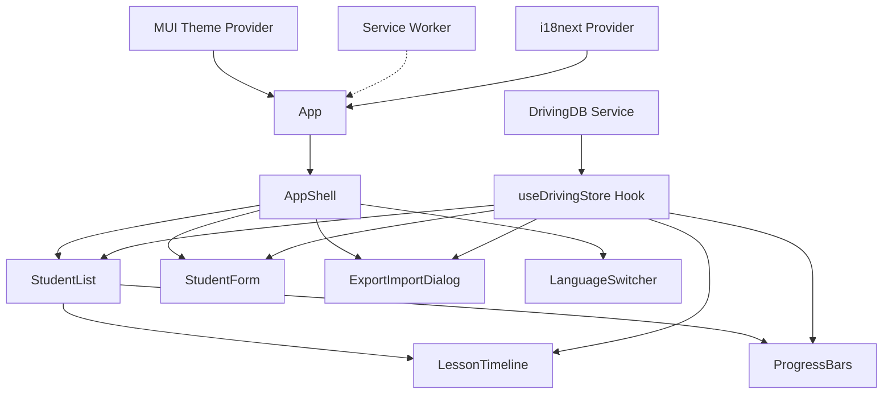
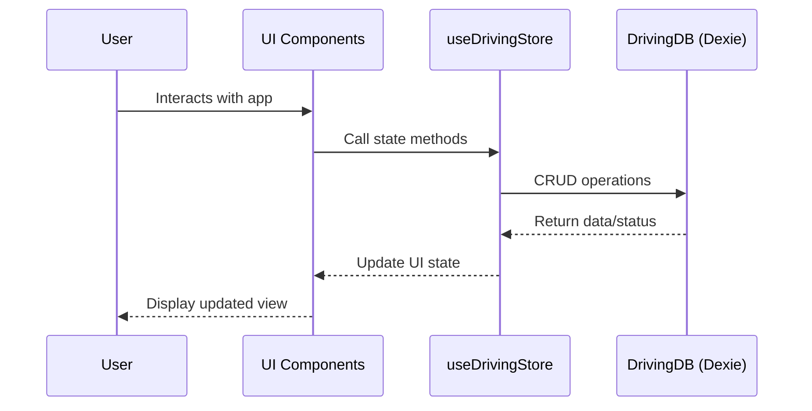

# 1. Title: PRD for Driving-Lesson Tracker (PWA)

<version>1.0.0</version>

## Status: Draft

## Intro

Driving-Lesson Tracker is a Progressive Web Application designed to help driving instructors track their students' progress, lesson details, and driving minutes in an offline-first approach. This PRD defines the requirements, features, and goals for developing a privacy-focused, easy-to-use application that works across desktop and mobile devices, with all data processing and storage happening directly on the client.

## Goals

- Create an intuitive interface for tracking driving lessons and student progress
- Ensure full offline functionality with data persistence in browser
- Enable installation on mobile devices as a PWA
- Provide export/import capabilities for data backup and transfer
- Support tracking of lesson topics, driving minutes, and student notes
- Minimize learning curve for non-technical driving instructors
- Create a responsive design that works equally well on desktop and mobile
- Ensure data privacy by storing all information locally
- Support Finnish as the primary language with English and Swedish as secondary options

## Features and Requirements

- **Offline-First Operation**
  - Application must function without internet connection
  - All data must be stored locally in the browser
  - Changes must sync with local storage immediately

- **Student Management**
  - Add, edit, and delete student profiles
  - Track contact information and notes
  - View comprehensive student history

- **Lesson Tracking**
  - Record lesson date, duration, and topics covered
  - Add instructor notes for each lesson
  - View lessons in chronological order

- **Progress Visualization**
  - Display total driving minutes per student
  - Show topic coverage statistics
  - Highlight areas needing more practice

- **Data Portability**
  - Export all data as JSON
  - Import data from exported file
  - Data validation during import process

- **Progressive Web App**
  - Installable on mobile devices
  - Responsive design for all screen sizes
  - App icon and splash screen
  - Offline capabilities via service worker

- **Internationalization**
  - Finnish as primary language
  - Support for English and Swedish as secondary languages
  - Date and number formatting according to locale
  - Ability to switch languages within the application

## Epic List

### Epic-1: Core Application Foundation
Status: In Progress

### Epic-2: Student and Lesson Management
Status: Not Started

### Epic-3: Data Visualization and Reporting
Status: Not Started

### Epic-4: PWA Implementation
Status: Not Started

### Epic-5: Future Enhancements (Beyond Current Scope)
Status: Not Started

## Epic 1: Story List

- Story 1: Project Setup and Configuration
  Status: Completed
  Requirements:
  - Initialize project with Vite + React + TypeScript
  - Configure ESLint and formatting rules
  - Set up Material-UI with custom theme
  - Implement base project structure
  
- Story 2: Database Implementation
  Status: In Progress
  Requirements:
  - Set up Dexie.js for IndexedDB access
  - Create database schema for students and lessons
  - Implement base CRUD operations
  - Create data migration strategy for future updates

- Story 3: Basic UI Navigation and Internationalization
  Status: In Progress
  Requirements:
  - Create AppShell component with navigation
  - Implement responsive layout
  - Create placeholder pages for main features
  - Add loading states and error handling
  - Set up react-i18next for multilingual support
  - Implement language switching functionality
  - Create initial Finnish translations

## Epic 2: Story List

- Story 1: Student Management UI
  Status: Not Started
  Requirements:
  - Create form for adding/editing students
  - Implement student list view with search/filter
  - Add validation for student data
  - Implement student deletion with confirmation

- Story 2: Lesson Recording Functionality
  Status: Not Started
  Requirements:
  - Create form for adding new lessons
  - Implement topic selection interface
  - Add timer feature for tracking lesson duration
  - Create lesson history view

- Story 3: Student-Lesson Relationship
  Status: Not Started
  Requirements:
  - Link lessons to specific students
  - Display lesson history per student
  - Calculate and display total driving time
  - Implement filter/sort for lesson history

## Technology Stack

| Technology | Description |
| ------------ | ------------------------------------------------------------- |
| Vite 6.x | Build tool and development environment for fast HMR and builds |
| React 18.x | UI library for component-based development |
| TypeScript 5.x | Typed JavaScript for improved developer experience and code safety |
| Material-UI (MUI) 5.x | React component library implementing Google's Material Design |
| Emotion | CSS-in-JS styling solution used with MUI |
| Dexie.js 3.x | Minimalistic wrapper for IndexedDB with a friendly API |
| dexie-react-hooks | React hooks for reactive data access with Dexie (useLiveQuery) |
| dexie-export-import | Extension for JSON data export and import capabilities |
| vite-plugin-pwa | PWA integration for Vite projects including service worker and manifest |
| Workbox | Library for service worker generation and caching strategies |
| Zod | TypeScript-first schema validation library for data validation |
| react-i18next | Internationalization framework for React applications |
| i18next | Core i18n library that powers react-i18next |
| i18next-browser-languagedetector | Auto language detection for i18next |

## Reference

### Component Flow Diagram



### User Flow Diagram



## Data Models, API Specs, Schemas, etc...

### Student Entity

```typescript
interface Student {
  id?: string;       // Auto-generated UUID if not provided
  name: string;      // Student's full name
  email?: string;    // Optional contact email
  notes?: string;    // Optional additional notes
  createdAt: Date;   // When the student record was created
}
```

### Lesson Entity

```typescript
interface Lesson {
  id?: string;                 // Auto-generated UUID if not provided
  studentId: string;           // References Student.id
  date: Date;                  // Date of the lesson
  durationMinutes: number;     // Length of lesson in minutes
  topics: string[];            // Array of topics covered
  notes?: string;              // Optional additional notes
}
```

### Export/Import JSON Schema

```typescript
interface ExportData {
  version: string;             // Schema version for future compatibility
  exportDate: string;          // ISO timestamp of when export was created
  students: Student[];         // Array of student records
  lessons: Lesson[];           // Array of lesson records
}
```

## Project Structure

```
├── /public                    # Static assets
│   ├── favicon.svg           # Favicon
│   ├── pwa-192.png           # PWA icon (192x192)
│   ├── pwa-512.png           # PWA icon (512x512)
│   └── manifest.webmanifest  # Web app manifest (auto-generated)
├── /src
│   ├── /components           # React UI components
│   ├── /hooks                # Custom React hooks
│   ├── /services             # Business logic and data services
│   ├── /theme                # MUI theme configuration
│   ├── /types                # TypeScript type definitions
│   ├── /utils                # Utility functions
│   ├── /locales              # i18n translation files
│   │   ├── /fi               # Finnish translations (primary)
│   │   ├── /en               # English translations
│   │   └── /sv               # Swedish translations
│   ├── App.tsx               # Main App component
│   ├── main.tsx              # Application entry point
│   ├── i18n.ts               # i18next configuration
│   └── sw-register.ts        # Service Worker registration
```

## Change Log

| Date       | Version | Description |
|------------|---------|-------------|
| 2024-06-04 | 1.0.0   | Initial PRD draft created |
| 2024-06-08 | 1.0.1   | Added internationalization requirements | 