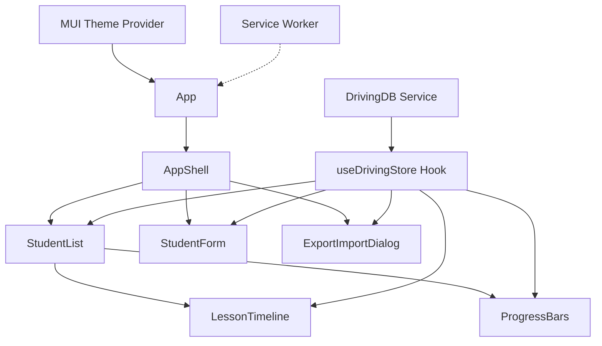
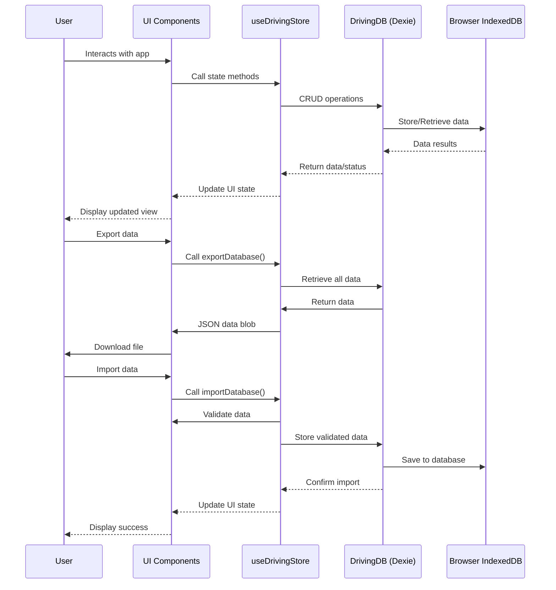

# Architecture for Driving-Lesson Tracker (PWA)

Status: Approved

## Technical Summary

Driving-Lesson Tracker is a Progressive Web Application (PWA) that enables driving instructors to track students' lessons, topics covered, and driving minutes in an offline-first approach. The application uses a Vite + React + TypeScript stack with Material-UI (MUI) for the UI components and Dexie.js as a wrapper for IndexedDB to store data locally in the browser. The PWA features enable installation on mobile devices, offline functionality, and export/import capabilities for data backup and transfer between devices.

As a client-side only application, this solution doesn't require a backend server for the core functionality, making it privacy-focused and accessible even in poor network conditions. The architecture prioritizes a responsive design that works across desktop and mobile devices, with all data processing and storage happening directly on the client.

## Technology Table

| Technology | Description |
| ------------ | ------------------------------------------------------------- |
| Vite 6.x | Build tool and development environment for fast HMR and builds |
| React 18.x | UI library for component-based development |
| TypeScript 5.x | Typed JavaScript for improved developer experience and code safety |
| Material-UI (MUI) 5.x | React component library implementing Google's Material Design |
| Emotion | CSS-in-JS styling solution used with MUI |
| Dexie.js 3.x | Minimalistic wrapper for IndexedDB with a friendly API |
| dexie-react-hooks | React hooks for reactive data access with Dexie (useLiveQuery) |
| dexie-export-import | Extension for JSON data export and import capabilities |
| vite-plugin-pwa | PWA integration for Vite projects including service worker and manifest |
| Workbox | Library for service worker generation and caching strategies |
| Zod | TypeScript-first schema validation library for data validation |
| ESLint | Static code analysis tool for identifying problematic patterns |
| react-i18next | Internationalization framework for React |

## Architectural Diagrams

### Component Architecture



### Data Flow



## Data Models, API Specs, Schemas, etc...

### Student Entity

```typescript
interface Student {
  id?: string;       // Auto-generated UUID if not provided
  name: string;      // Student's full name
  email?: string;    // Optional contact email
  notes?: string;    // Optional additional notes
  createdAt: Date;   // When the student record was created
}
```

### Lesson Entity

```typescript
interface Lesson {
  id?: string;                 // Auto-generated UUID if not provided
  studentId: string;           // References Student.id
  date: Date;                  // Date of the lesson
  durationMinutes: number;     // Length of lesson in minutes
  topics: string[];            // Array of topics covered (e.g., 'basic driving', 'traffic', 'highway')
  notes?: string;              // Optional additional notes
}
```

### Export/Import JSON Schema

```typescript
interface ExportData {
  version: string;             // Schema version for future compatibility
  exportDate: string;          // ISO timestamp of when export was created
  students: Student[];         // Array of student records
  lessons: Lesson[];           // Array of lesson records
}
```

## Project Structure

```
├── /public                    # Static assets
│   ├── favicon.svg           # Favicon
│   ├── pwa-192.png           # PWA icon (192x192)
│   ├── pwa-512.png           # PWA icon (512x512)
│   └── manifest.webmanifest  # Web app manifest (auto-generated)
├── /src
│   ├── /components           # React UI components
│   │   ├── AppShell.tsx      # Main layout wrapper with navigation
│   │   ├── StudentList.tsx   # List of students
│   │   ├── StudentForm.tsx   # Modal form for adding/editing students
│   │   ├── LessonTimeline.tsx# Shows lessons for a student
│   │   ├── ProgressBars.tsx  # Visual progress indicators
│   │   └── ExportImportDialog.tsx # Data export/import UI
│   ├── /hooks                # Custom React hooks
│   │   └── useDrivingStore.ts# Data management hook
│   ├── /services             # Business logic and data services
│   │   ├── DrivingDB.ts      # Dexie database definition
│   │   └── CryptoService.ts  # Optional encryption (future)
│   ├── /theme                # MUI theme configuration
│   │   └── theme.ts          # Theme settings, colors, typography
│   ├── /types                # TypeScript type definitions
│   │   └── index.ts          # Shared type interfaces
│   ├── /utils                # Utility functions
│   │   └── validation.ts     # Data validation helpers
│   ├── /locales              # Internationalization resources
│   │   ├── /fi               # Finnish translations (primary)
│   │   ├── /en               # English translations
│   │   └── /sv               # Swedish translations
│   ├── App.tsx               # Main App component
│   ├── main.tsx              # Application entry point
│   ├── i18n.ts               # i18next configuration
│   ├── vite-env.d.ts         # Vite environment type declarations
│   └── sw-register.ts        # Service Worker registration
├── .eslintrc.js              # ESLint configuration
├── index.html                # HTML template
├── package.json              # Project dependencies and scripts
├── tsconfig.json             # TypeScript configuration
└── vite.config.ts            # Vite and PWA configuration
```

## Infrastructure

As a client-side only PWA, this application doesn't require traditional backend infrastructure. The application is statically hosted with the following considerations:

- **Hosting**: Static file hosting (Netlify, Vercel, GitHub Pages, or similar)
- **CDN**: Content Delivery Network for optimized asset delivery
- **HTTPS**: Secure connection required for PWA and Service Worker functionality
- **Cache Headers**: Proper configuration for static assets

## Deployment Plan

1. **Development Environment**:
   - Local development using `npm run dev`
   - Testing PWA features with `npm run preview`

2. **Staging Environment**:
   - Automated build and deploy to staging URL on PR creation
   - Testing on various devices and browsers

3. **Production Environment**:
   - Automated build and deploy on merge to main branch
   - PWA audit and performance checks (Lighthouse)
   - Cache strategies verification

## Change Log

| Date | Version | Description |
|------|---------|-------------|
| 2025-07-01 | 0.1.0 | Initial architecture document |

## Core Architecture Components

### Component Organization

The application follows a feature-based component organization:

1. **Layout Components**: Define the overall structure of the application
   - `AppShell`: The main container with navigation
   - `PageContainer`: Standardized page layout

2. **Feature Components**: Components specific to a feature area
   - `students/`: Student management components
   - `lessons/`: Lesson tracking components
   - `settings/`: Application settings components

3. **Common Components**: Reusable across features
   - `LoadingIndicator`
   - `ErrorBoundary`
   - `EmptyState`
   - `ConfirmationDialog`

### Data Flow

The application uses a unidirectional data flow:

1. **Data Storage**: IndexedDB via Dexie.js
2. **Data Access**: Custom hooks using `useLiveQuery` from Dexie
3. **UI Components**: Consume data hooks and dispatch actions

```
┌──────────────┐    ┌──────────────┐    ┌──────────────┐
│              │    │              │    │              │
│  Components  │◄───┤  Data Hooks  │◄───┤  Dexie.js    │
│              │    │              │    │              │
└──────┬───────┘    └──────────────┘    └──────────────┘
       │                                        ▲
       │                                        │
       ▼                                        │
┌──────────────┐                        ┌──────────────┐
│              │                        │              │
│   Actions    │───────────────────────►│  IndexedDB   │
│              │                        │              │
└──────────────┘                        └──────────────┘
```

### Internationalization Architecture

The app uses react-i18next for internationalization with the following setup:

1. **Translation Organization**:
   - Namespaced by feature (common, students, lessons)
   - JSON files per language in `/locales/{lang}/{namespace}.json`
   - Finnish as the default language with English and Swedish support

2. **i18n Integration**:
   - Configured in `i18n.ts` 
   - I18nextProvider wraps the application in `App.tsx`
   - Component access via `useTranslation` hook

3. **Language Handling**:
   - Language detection based on browser preferences
   - Manual language switching via settings
   - Persistent language preference in local storage

4. **Date/Number Formatting**:
   - Locale-aware date formatting using Intl.DateTimeFormat
   - Number formatting respecting locale conventions

### Offline Capabilities

The application works offline through several mechanisms:

1. **Service Worker**: Caches app shell and assets
2. **IndexedDB**: Stores all application data locally
3. **PWA Manifest**: Enables installation on devices

### Progressive Enhancement

The application follows progressive enhancement principles:

1. **Core Functionality**: Works with basic JavaScript
2. **Enhanced Experience**: Added features with modern APIs
3. **Offline Support**: Service worker as an enhancement
4. **Installation**: PWA capabilities as an enhancement

## Development Patterns

### Component Patterns

- **Compound Components**: For complex, stateful components
- **Controlled Components**: For form elements
- **Render Props**: For sharing complex rendering logic

### TypeScript Patterns

- **Type-First Development**: Define types before implementation
- **Interface Segregation**: Small, focused interfaces
- **Discriminated Unions**: For state management

### State Management

- **Local Component State**: For UI-specific state
- **Shared State**: Using React Context when needed
- **Database State**: Using Dexie.js reactive queries

## Future Enhancements

Future architecture enhancements may include:

1. **State Machine**: For complex workflows
2. **Server Synchronization**: Optional cloud backup
3. **Performance Optimizations**: Virtualized lists, memoization
4. **Automated Testing**: Component and integration tests

## Dependencies

| Dependency | Purpose |
|------------|---------|
| React | UI library |
| TypeScript | Type safety |
| Vite | Build tool |
| Material-UI | UI component library |
| Dexie.js | IndexedDB wrapper |
| react-i18next | Internationalization |
| i18next | Core i18n library |
| i18next-browser-languagedetector | Auto language detection |
| zod | Data validation |
| date-fns | Date manipulation | 