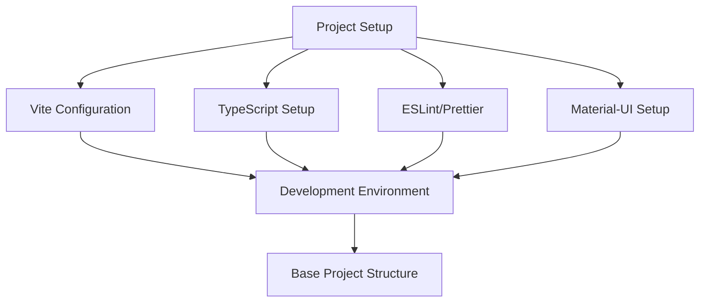

# Epic-1 - Story-1

Project Setup and Configuration

**As a** developer
**I want** a properly configured React project with TypeScript and Material-UI
**so that** I can develop the Driving-Lesson Tracker application efficiently with modern tools

## Status

In Progress

## Context

This is the first story in the project, focusing on establishing the technical foundation for the Driving-Lesson Tracker PWA. A proper setup with the right tools and configurations is essential for efficient development and code quality throughout the project. 

The decisions made in this story will impact all subsequent development efforts, so careful consideration of technology choices and project structure is critical.

## Estimation

Story Points: 1

## Tasks

1. - [x] Initialize project with Vite and React
   1. - [x] Create new Vite project with React and TypeScript templates
   2. - [x] Configure project structure
   3. - [x] Initialize Git repository

2. - [x] Configure TypeScript
   1. - [x] Set up tsconfig.json with strict mode
   2. - [x] Configure path aliases
   3. - [x] Add type definitions for third-party libraries

3. - [x] Set up ESLint and Prettier
   1. - [x] Install ESLint and Prettier
   2. - [x] Configure ESLint rules
   3. - [x] Set up Prettier for code formatting
   4. - [x] Add pre-commit hooks for code quality checks

4. - [x] Implement Material-UI
   1. - [x] Install MUI and related dependencies
   2. - [x] Create custom theme
   3. - [x] Set up ThemeProvider
   4. - [x] Configure responsive breakpoints

5. - [ ] Establish base project structure
   1. - [x] Create component directory structure
   2. - [x] Set up service directories
   3. - [ ] Create placeholder files for essential components
   4. - [ ] Document project architecture

## Constraints

- Must support mobile and desktop browsers
- Performance optimization is essential for mobile usage
- Must follow accessibility guidelines

## Data Models / Schema

N/A for project setup - will be defined in subsequent stories.

## Structure

```
├── /public                    # Static assets
│   ├── favicon.svg           # Favicon
├── /src
│   ├── /components           # React UI components
│   │   ├── /common           # Shared components
│   │   ├── /layout           # Layout components
│   │   ├── /pages            # Page components
│   ├── /hooks                # Custom React hooks
│   ├── /services             # Business logic and data services
│   ├── /theme                # MUI theme configuration
│   ├── /types                # TypeScript type definitions
│   ├── /utils                # Utility functions
│   ├── App.tsx               # Main App component
│   ├── main.tsx              # Application entry point
│   └── vite-env.d.ts         # Vite environment types
```

## Diagrams



## Dev Notes

- Chose Vite over Create React App due to faster build times and better development experience
- Selected MUI v5 for its comprehensive component library and theming capabilities
- Configured ESLint with the Airbnb preset as a starting point, with customizations for project needs
- Set up strict TypeScript configuration to catch potential issues early in development
- Added path aliases to avoid excessive relative imports 