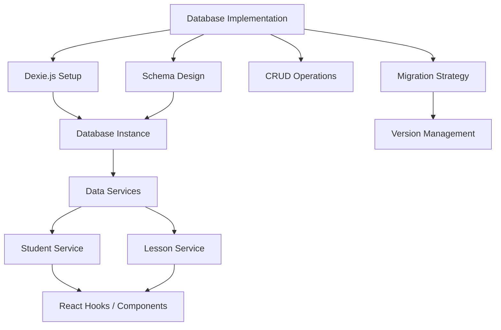
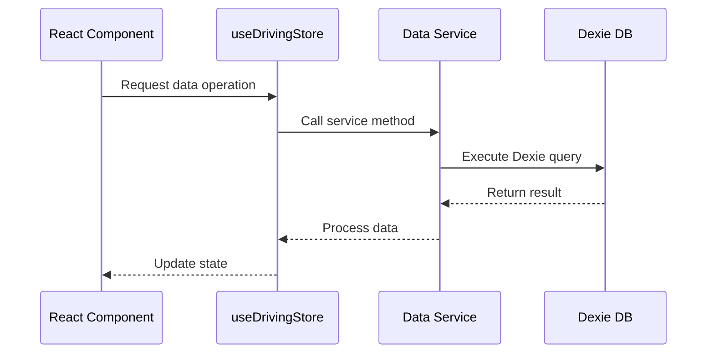

# Epic-1 - Story-2

Database Implementation

**As a** developer
**I want** a local database solution for offline data storage
**so that** users can access and modify their data without an internet connection

## Status

Not Started

## Context

This story implements the data persistence layer for the Driving-Lesson Tracker application. Since offline functionality is a core requirement, we need a robust client-side database solution that can store and retrieve student and lesson data reliably.

Dexie.js has been selected as the IndexedDB wrapper due to its simplicity, performance, and support for complex data operations with a user-friendly API. This story establishes the foundation for all data access throughout the application.

## Estimation

Story Points: 2

## Tasks

1. - [ ] Set up Dexie.js for IndexedDB
   1. - [ ] Install Dexie.js and dependencies
   2. - [ ] Create database configuration
   3. - [ ] Set up version management for schema migrations

2. - [ ] Design and implement database schema
   1. - [ ] Define Student table schema
   2. - [ ] Define Lesson table schema
   3. - [ ] Create relationships between tables
   4. - [ ] Add indexes for efficient querying

3. - [ ] Implement base CRUD operations
   1. - [ ] Create data service for Students
   2. - [ ] Create data service for Lessons
   3. - [ ] Write utility functions for common queries
   4. - [ ] Implement data validation

4. - [ ] Create data migration strategy
   1. - [ ] Design version upgrade mechanism
   2. - [ ] Implement schema migration helpers
   3. - [ ] Add data backup before migrations
   4. - [ ] Create migration tests

5. - [ ] Implement error handling
   1. - [ ] Create custom error types
   2. - [ ] Add error logging service
   3. - [ ] Implement recovery strategies

## Constraints

- All data must be stored locally in the browser
- Must handle varying browser support for IndexedDB
- Database operations must be non-blocking (asynchronous)
- Need to handle limited storage capacity on mobile devices

## Data Models / Schema

```typescript
// Database definition
class DrivingDB extends Dexie {
  students!: Table<Student, string>;
  lessons!: Table<Lesson, string>;

  constructor() {
    super('drivingLessonTracker');
    
    this.version(1).stores({
      students: 'id, name, email, createdAt',
      lessons: 'id, studentId, date, durationMinutes, *topics'
    });
  }
}

// Student Entity
interface Student {
  id?: string;       // Auto-generated UUID if not provided
  name: string;      // Student's full name
  email?: string;    // Optional contact email
  notes?: string;    // Optional additional notes
  createdAt: Date;   // When the student record was created
}

// Lesson Entity
interface Lesson {
  id?: string;                 // Auto-generated UUID if not provided
  studentId: string;           // References Student.id
  date: Date;                  // Date of the lesson
  durationMinutes: number;     // Length of lesson in minutes
  topics: string[];            // Array of topics covered
  notes?: string;              // Optional additional notes
}
```

## Structure

```
├── /src
│   ├── /services
│   │   ├── /db
│   │   │   ├── db.ts                 # Main database instance
│   │   │   ├── migrations.ts         # Schema migrations
│   │   │   ├── studentService.ts     # Student CRUD operations
│   │   │   ├── lessonService.ts      # Lesson CRUD operations
│   │   │   └── errorHandling.ts      # Error handling utilities
│   ├── /types
│   │   └── /db
│   │       ├── student.ts            # Student type definitions
│   │       └── lesson.ts             # Lesson type definitions
│   └── /hooks
│       └── useDrivingStore.ts        # React hook for data access
```

## Diagrams





## Dev Notes

- Using UUID v4 for primary keys instead of auto-incrementing numbers for better offline support and sync capabilities
- Added multi-entry index on Lesson.topics to enable efficient querying by topic
- All database operations are wrapped in try/catch blocks with custom error handling
- Created a comprehensive migration strategy to handle future schema changes
- Added utilities for common query patterns to standardize data access across the application 