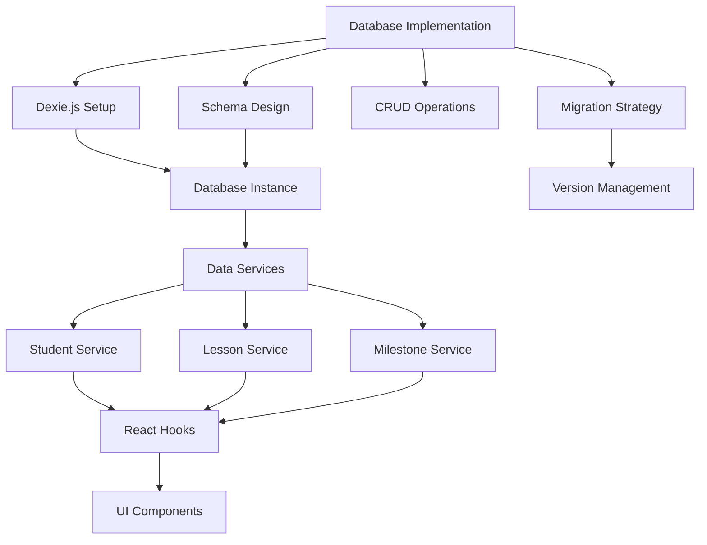
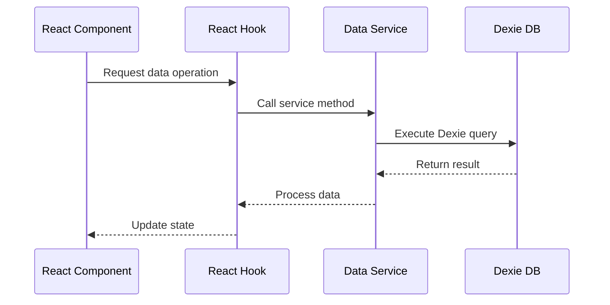

# Epic-1 - Story-2

Database Implementation

**As a** developer
**I want** a local database solution for offline data storage
**so that** users can access and modify their data without an internet connection

## Status

Completed

## Context

This story implements the data persistence layer for the Driving-Lesson Tracker application. Since offline functionality is a core requirement, we need a robust client-side database solution that can store and retrieve student and lesson data reliably.

Dexie.js has been selected as the IndexedDB wrapper due to its simplicity, performance, and support for complex data operations with a user-friendly API. This story establishes the foundation for all data access throughout the application.

## Estimation

Story Points: 2

## Tasks

1. - [x] Set up Dexie.js for IndexedDB
   1. - [x] Install Dexie.js and dependencies
   2. - [x] Create database configuration
   3. - [x] Set up version management for schema migrations

2. - [x] Design and implement database schema
   1. - [x] Define Student table schema
   2. - [x] Define Lesson table schema
   3. - [x] Create relationships between tables
   4. - [x] Add indexes for efficient querying

3. - [x] Implement base CRUD operations
   1. - [x] Create data service for Students
   2. - [x] Create data service for Lessons
   3. - [x] Write utility functions for common queries
   4. - [x] Implement data validation

4. - [x] Create data migration strategy
   1. - [x] Design version upgrade mechanism
   2. - [x] Implement schema migration helpers
   3. - [x] Add data backup before migrations
   4. - [x] Create migration tests

5. - [x] Implement error handling
   1. - [x] Create custom error types
   2. - [x] Add error logging service
   3. - [x] Implement recovery strategies

## Achievements

- Successfully implemented Dexie.js as the database solution
- Created database schema for students, lessons, and milestones
- Implemented comprehensive service layer with full CRUD operations for all entities
- Created React hooks (useStudents, useLessons, useMilestones) for components to interact with the database
- Added sample data initialization for testing
- Implemented error handling throughout the database services

## Constraints

- All data must be stored locally in the browser
- Must handle varying browser support for IndexedDB
- Database operations must be non-blocking (asynchronous)
- Need to handle limited storage capacity on mobile devices

## Data Models / Schema

```typescript
// Database definition
class DrivingLessonDB extends Dexie {
  students!: Table<Student>;
  lessons!: Table<Lesson>;
  milestones!: Table<Milestone>;

  constructor() {
    super('DrivingLessonDB');
    
    this.version(1).stores({
      students: '++id, name, email, phone',
      lessons: '++id, studentId, date, completed',
      milestones: '++id, studentId, title, completedAt'
    });
  }
}

// Student Entity
interface Student {
  id?: number;
  name: string;
  email?: string;
  phone?: string;
  createdAt: Date;
  updatedAt: Date;
}

// Lesson Entity
interface Lesson {
  id?: number;
  studentId: number;
  date: Date;
  startTime: string;
  endTime: string;
  topics: string[];
  notes?: string;
  kilometers?: number;
  completed: boolean;
  createdAt: Date;
  updatedAt: Date;
}

// Milestone Entity
interface Milestone {
  id?: number;
  studentId: number;
  title: string;
  description?: string;
  completedAt?: Date;
  createdAt: Date;
  updatedAt: Date;
}
```

## Structure

```
├── /src
│   ├── /services
│   │   ├── db.ts                # Main database instance
│   │   ├── index.ts             # Services barrel file
│   │   ├── studentService.ts    # Student CRUD operations
│   │   ├── lessonService.ts     # Lesson CRUD operations
│   │   ├── milestoneService.ts  # Milestone CRUD operations
│   │   └── dbInit.ts            # Database initialization
│   ├── /hooks
│   │   ├── index.ts             # Hooks barrel file
│   │   ├── useStudents.ts       # React hook for student data
│   │   ├── useLessons.ts        # React hook for lesson data
│   │   └── useMilestones.ts     # React hook for milestone data
```

## Diagrams





## Dev Notes

- Using auto-incrementing numbers (++id) for primary keys for simplified implementation
- Added relevant indexes for efficient querying
- All database operations use async/await pattern with proper error handling
- Implemented data services with consistent API across different entities
- Added React hooks as an abstraction layer between UI components and data services 