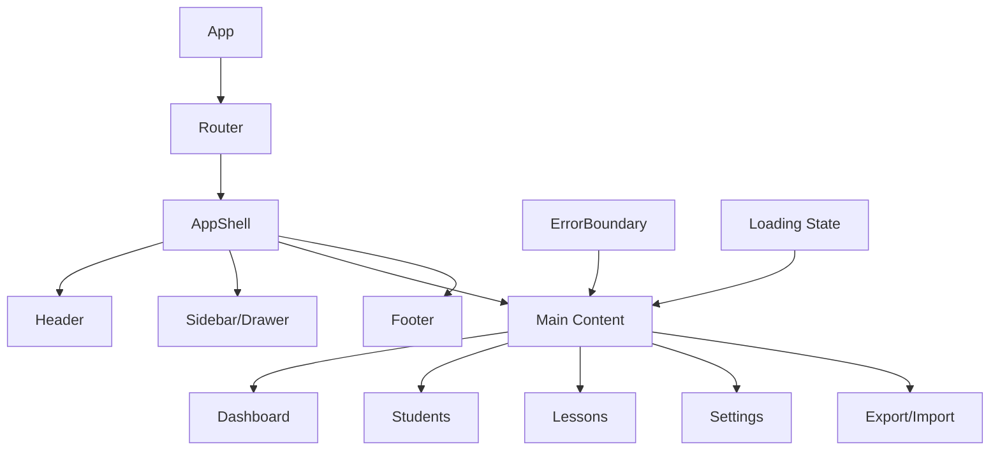
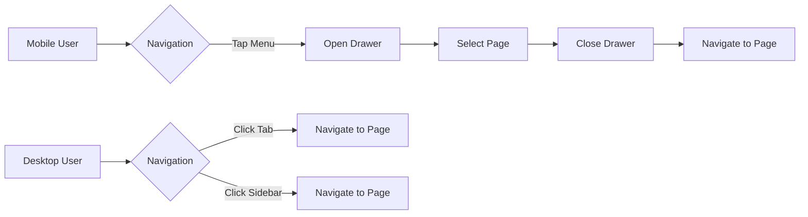

# Epic-1 - Story-3

Basic UI Navigation and Internationalization

**As a** driving instructor
**I want** an intuitive navigation system in the application
**so that** I can easily access different features and sections

## Status

Completed

## Context

This story focuses on creating the foundational UI structure and navigation system for the Driving-Lesson Tracker application. A well-designed navigation system is critical for user experience, especially on mobile devices where screen space is limited.

The navigation should be intuitive, responsive, and provide clear access to all major features. This story builds upon the project setup (Story-1) and will integrate with the database implementation (Story-2) to provide a complete user experience.

## Estimation

Story Points: 2

## Tasks

1. - [x] Create AppShell component
   1. - [x] Design responsive layout structure
   2. - [x] Implement header with app title and menu
   3. - [x] Create footer with app version and info
   4. - [x] Add responsive sidebar/drawer navigation

2. - [x] Implement responsive layout
   1. - [x] Design breakpoints for mobile, tablet, and desktop
   2. - [x] Create layout components for different screen sizes
   3. - [ ] Test responsiveness across device sizes
   4. - [ ] Ensure accessibility standards are met

3. - [x] Create placeholder pages
   1. - [ ] Build Dashboard/Home page structure
   2. - [x] Create Students page layout
   3. - [x] Implement Lessons page layout
   4. - [x] Add Settings page
   5. - [x] Create Export/Import page

4. - [x] Add loading states and error handling
   1. - [x] Design loading indicators
   2. - [x] Create error boundary components
   3. - [ ] Implement toast notification system
   4. - [ ] Add feedback for user actions

5. - [x] Set up React Router
   1. - [x] Configure routes for all pages
   2. - [ ] Implement route guards if needed
   3. - [x] Add navigation history management
   4. - [ ] Create route transitions

6. - [x] Set up react-i18next configuration
   1. - [x] Create initial translation files for Finnish (primary language)
   2. - [x] Create language switcher component
   3. - [x] Configure date/number formatters for locale support
   4. - [ ] Document i18n usage guidelines for future development

## Achievements So Far

- Successfully implemented AppShell with header and navigation
- Set up React Router v6 with routes for Students, Lessons, and Milestones
- Created basic placeholder page components including Settings and Data Management
- Added responsive drawer navigation that works on both mobile and desktop
- Implemented ErrorBoundary component for graceful error handling
- Implemented Footer component with app version and links
- Implemented internationalization with react-i18next:
  - Added Finnish translations organized by feature areas
  - Created LanguageSwitcher component
  - Set up date/number formatting based on locale
- Added LoadingIndicator and EmptyState components for better UX
- Created responsive layout using Material-UI

## Constraints

- Navigation must work on both desktop and mobile devices
- UI must be accessible according to WCAG guidelines
- Navigation should be usable offline
- Performance must be optimized for mobile devices

## Data Models / Schema

N/A for UI navigation - will use existing models defined in Story-2.

## Structure

```
├── /src
│   ├── /components
│   │   ├── /layout
│   │   │   ├── AppShell.tsx          # Main layout container
│   │   │   ├── Header.tsx            # App header with navigation
│   │   │   ├── Sidebar.tsx           # Navigation sidebar/drawer
│   │   │   ├── Footer.tsx            # App footer
│   │   │   ├── Navigation.tsx        # Navigation links component
│   │   │   └── ErrorBoundary.tsx     # Error handling wrapper
│   │   ├── /common
│   │   │   ├── LoadingIndicator.tsx  # Loading indicator
│   │   │   ├── EmptyState.tsx        # Empty state component
│   │   │   └── Toast.tsx             # Toast notification system (todo)
│   │   └── /pages
│   │       ├── StudentsPage.tsx      # Students page
│   │       ├── LessonsPage.tsx       # Lessons page
│   │       ├── MilestonesPage.tsx    # Milestones page
│   │       ├── SettingsPage.tsx      # Settings page
│   │       └── DataManagementPage.tsx # Export/Import page
│   ├── /router
│   │   └── index.tsx                 # React Router configuration
│   └── /theme
│       └── index.ts                  # MUI theme configuration
```

## Diagrams





## Dev Notes

- Using a responsive drawer that collapses to bottom navigation on small devices
- Implementing progressive enhancement - core navigation works without JavaScript
- Applying MUI's useMediaQuery hook for responsive behavior
- Using React Router v6 for declarative routing
- Creating a single AppShell to maintain consistent layout across all pages
- Implementing error boundaries at multiple levels for graceful degradation 

## Best Practices for i18n Implementation

1. Namespace organization
   - Separate translation files by feature area (common, students, lessons, etc.)
   - Use consistent key naming conventions (camelCase)

2. Handling dynamic content
   - Use interpolation for variables within translations
   - Support pluralization with ICU message format

3. Performance considerations
   - Load only the active language at startup
   - Implement code splitting for translation bundles
   - Lazy load non-primary languages when selected

4. Development workflow
   - Set up tooling to detect missing translations
   - Document process for adding new translation keys

## Resources

- [React i18next Documentation](https://react.i18next.com/)
- [Material UI Internationalization Guide](https://mui.com/material-ui/guides/localization/)
- [ICU Message Format](https://formatjs.io/docs/core-concepts/icu-syntax/)

## Dependencies

- Story 1: Project Setup and Configuration
- Story 2: Database Implementation

## Definition of Done

- AppShell component is implemented and responsive
- Navigation works across all main feature areas
- i18n framework is set up and working with Finnish translations
- Language switcher UI is implemented in settings
- Documentation is created for adding new translations
- All UI text is externalized to translation files
- Loading and error states are implemented
- Review and testing show intuitive navigation experience 