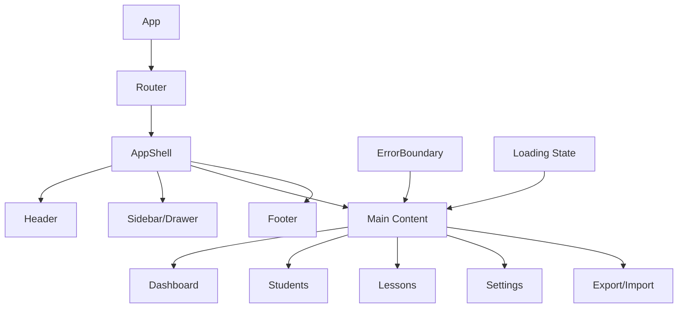
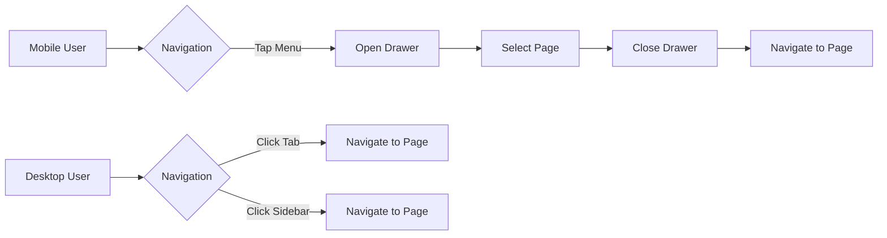

# Epic-1 - Story-3

Basic UI Navigation

**As a** driving instructor
**I want** an intuitive navigation system in the application
**so that** I can easily access different features and sections

## Status

Not Started

## Context

This story focuses on creating the foundational UI structure and navigation system for the Driving-Lesson Tracker application. A well-designed navigation system is critical for user experience, especially on mobile devices where screen space is limited.

The navigation should be intuitive, responsive, and provide clear access to all major features. This story builds upon the project setup (Story-1) and will integrate with the database implementation (Story-2) to provide a complete user experience.

## Estimation

Story Points: 2

## Tasks

1. - [ ] Create AppShell component
   1. - [ ] Design responsive layout structure
   2. - [ ] Implement header with app title and menu
   3. - [ ] Create footer with app version and info
   4. - [ ] Add responsive sidebar/drawer navigation

2. - [ ] Implement responsive layout
   1. - [ ] Design breakpoints for mobile, tablet, and desktop
   2. - [ ] Create layout components for different screen sizes
   3. - [ ] Test responsiveness across device sizes
   4. - [ ] Ensure accessibility standards are met

3. - [ ] Create placeholder pages
   1. - [ ] Build Dashboard/Home page structure
   2. - [ ] Create Students page layout
   3. - [ ] Implement Lessons page layout
   4. - [ ] Add Settings page
   5. - [ ] Create Export/Import page

4. - [ ] Add loading states and error handling
   1. - [ ] Design loading indicators
   2. - [ ] Create error boundary components
   3. - [ ] Implement toast notification system
   4. - [ ] Add feedback for user actions

5. - [ ] Set up React Router
   1. - [ ] Configure routes for all pages
   2. - [ ] Implement route guards if needed
   3. - [ ] Add navigation history management
   4. - [ ] Create route transitions

## Constraints

- Navigation must work on both desktop and mobile devices
- UI must be accessible according to WCAG guidelines
- Navigation should be usable offline
- Performance must be optimized for mobile devices

## Data Models / Schema

N/A for UI navigation - will use existing models defined in Story-2.

## Structure

```
├── /src
│   ├── /components
│   │   ├── /layout
│   │   │   ├── AppShell.tsx          # Main layout container
│   │   │   ├── Header.tsx            # App header with navigation
│   │   │   ├── Sidebar.tsx           # Navigation sidebar/drawer
│   │   │   ├── Footer.tsx            # App footer
│   │   │   └── ErrorBoundary.tsx     # Error handling wrapper
│   │   ├── /common
│   │   │   ├── Loading.tsx           # Loading indicator
│   │   │   ├── ErrorAlert.tsx        # Error display component
│   │   │   └── Toast.tsx             # Toast notification system
│   │   └── /pages
│   │       ├── Dashboard.tsx         # Home/dashboard page
│   │       ├── StudentList.tsx       # Students page
│   │       ├── LessonList.tsx        # Lessons page
│   │       ├── Settings.tsx          # Settings page
│   │       └── DataManagement.tsx    # Export/Import page
│   ├── /router
│   │   └── index.tsx                 # React Router configuration
│   └── /theme
│       └── components.ts             # MUI component customizations
```

## Diagrams





## Dev Notes

- Using a responsive drawer that collapses to bottom navigation on small devices
- Implementing progressive enhancement - core navigation works without JavaScript
- Applying MUI's useMediaQuery hook for responsive behavior
- Using React Router v6 for declarative routing
- Creating a single AppShell to maintain consistent layout across all pages
- Implementing error boundaries at multiple levels for graceful degradation 