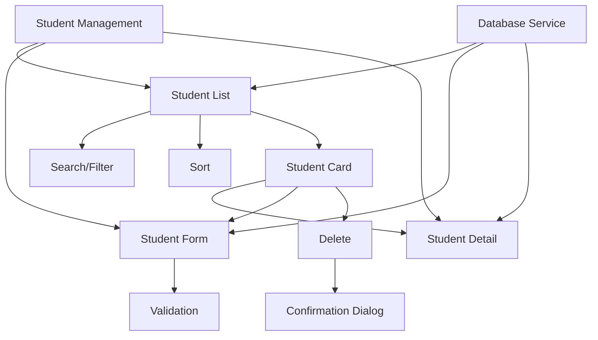
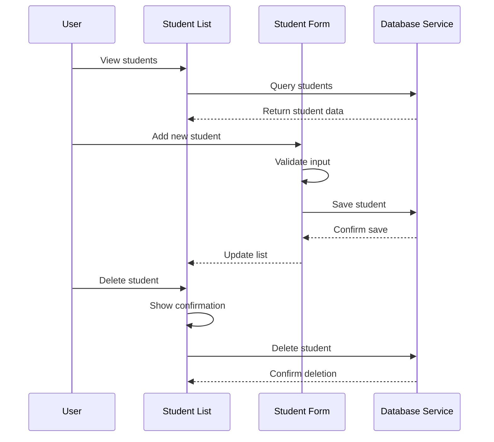

# Epic-2 - Story-1

Student Management UI

**As a** driving instructor
**I want** to manage my student information
**so that** I can keep track of all my students and their details

## Status

In Progress

## Context

This story implements the student management functionality for the Driving-Lesson Tracker application. Driving instructors need to maintain a list of their students with relevant contact information and notes. The UI should provide intuitive ways to add, edit, view, and delete student records.

This story builds on the database implementation (Epic-1 Story-2) and navigation structure (Epic-1 Story-3), focusing on creating user-friendly interfaces for student data management.

## Estimation

Story Points: 3

## Tasks

1. - [x] Create student form component
   1. - [x] Design form layout with Material-UI
   2. - [x] Implement form fields for student properties
   3. - [x] Add form validation with error messages
   4. - [x] Create both add and edit modes
   5. - [x] Implement form submission handling

2. - [x] Build student list view
   1. - [x] Create responsive list/grid of students
   2. - [ ] Implement search functionality
   3. - [ ] Add filtering options
   4. - [ ] Create sorting controls
   5. - [x] Design empty state for no students

3. - [ ] Implement student detail view
   1. - [ ] Design student profile layout
   2. - [ ] Show detailed student information
   3. - [ ] Add quick action buttons
   4. - [ ] Display lesson history preview
   5. - [ ] Implement edit option

4. - [x] Add student deletion functionality
   1. - [x] Create confirmation dialog
   2. - [ ] Implement soft delete option
   3. - [ ] Handle related lesson records
   4. - [ ] Add undo option for recent deletions

5. - [x] Connect UI to database services
   1. - [x] Integrate with student data service
   2. - [x] Implement real-time data updates
   3. - [x] Add error handling for database operations
   4. - [ ] Optimize for performance

## Constraints

- Must store all student data locally using IndexedDB
- UI must be responsive and work on mobile devices
- Must support offline operations
- Need to handle potentially large numbers of students efficiently
- Must maintain GDPR-compliant approach to personal data

## Data Models / Schema

Using the Student model from Epic-1 Story-2:

```typescript
interface Student {
  id?: string;       // Auto-generated UUID if not provided
  name: string;      // Student's full name
  email?: string;    // Optional contact email
  phone?: string;    // Optional phone number (new field)
  notes?: string;    // Optional additional notes
  createdAt: Date;   // When the student record was created
  updatedAt?: Date;  // When the student record was last modified (new field)
  isActive: boolean; // Whether the student is currently active (new field)
}

// Validation schema using Zod
const studentSchema = z.object({
  id: z.string().optional(),
  name: z.string().min(2, "Name must be at least 2 characters"),
  email: z.string().email("Invalid email address").optional().or(z.literal("")),
  phone: z.string().optional().or(z.literal("")),
  notes: z.string().optional().or(z.literal("")),
  createdAt: z.date(),
  updatedAt: z.date().optional(),
  isActive: z.boolean().default(true)
});
```

## Structure

```
├── /src
│   ├── /components
│   │   ├── /student
│   │   │   ├── StudentForm.tsx        # Form for adding/editing students
│   │   │   ├── StudentList.tsx        # List view of all students
│   │   │   ├── StudentCard.tsx        # Card display for a student
│   │   │   ├── StudentDetail.tsx      # Detailed view of a student
│   │   │   ├── StudentSearch.tsx      # Search and filter component
│   │   │   └── DeleteConfirmation.tsx # Dialog for delete confirmation
│   │   └── /common
│   │       ├── SearchField.tsx        # Reusable search component
│   │       └── EmptyState.tsx         # Component for empty data states
│   ├── /hooks
│   │   └── useStudents.ts             # Custom hook for student operations
│   └── /validation
│       └── studentSchema.ts           # Zod validation schema
```

## Diagrams





## Dev Notes

- Using reactive queries with Dexie react-hooks for real-time updates
- Implementing pagination for efficiency with large datasets
- Adding debounce to search input for performance
- Using virtualized lists if number of students is large
- Storing search/filter preferences in local storage for persistence
- Added soft delete capability to preserve historical data if needed 