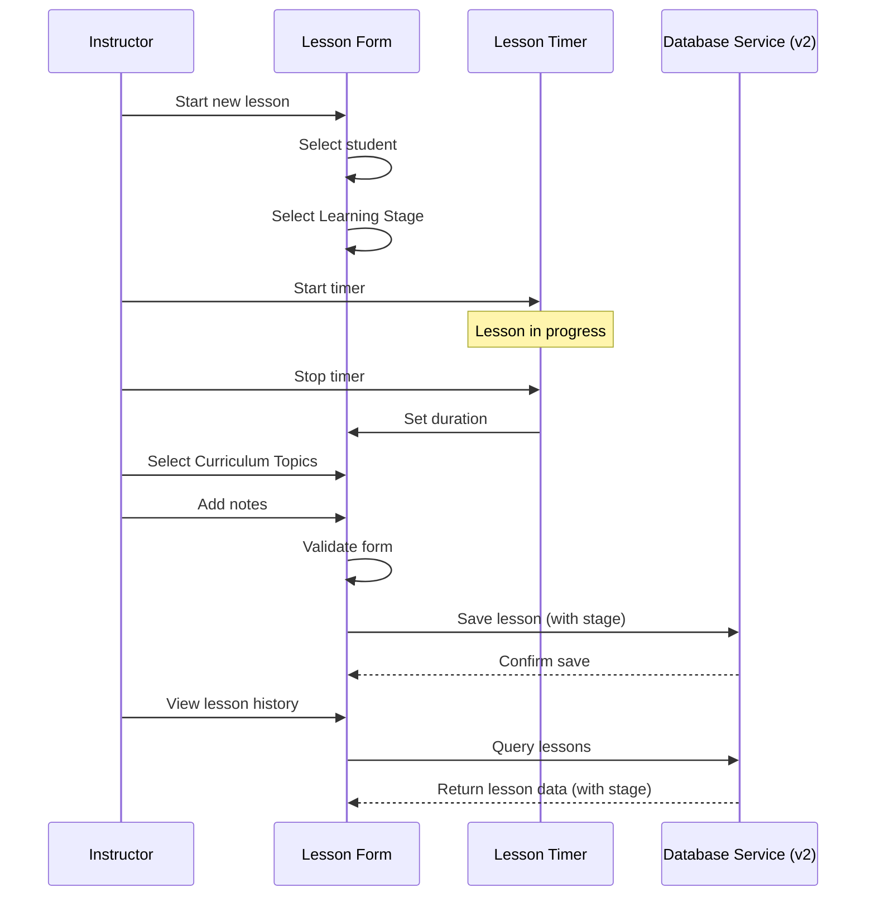

# Epic-2 - Story-2

Lesson Recording Functionality

**As a** driving instructor
**I want** to record details of driving lessons, including the learning stage based on the Finnish curriculum
**so that** I can track what was covered, align teaching with the curriculum, and keep a history of each student's progress

## Status

In Progress

## Context

This story implements the core lesson recording functionality, which is a key feature of the AjoKamu application. Instructors need to log details about each lesson, including date, duration, learning stage (kognitiivinen, assosiatiivinen, automaattinen), topics covered (aligned with the Finnish curriculum), and any relevant notes. The interface should make it quick and easy to add new lessons during or after the actual driving lesson.

This story builds on the database implementation (Epic-1 Story-2) and relates to the Student Management UI (Epic-2 Story-1), as lessons are associated with specific students.

## Estimation

Story Points: 3

## Tasks

1. - [x] Create lesson form component
   1. - [x] Design form layout with Material-UI
   2. - [x] Implement form fields for lesson properties (including learning stage)
   3. - [x] Create student selection interface
   4. - [ ] Add form validation
   5. - [x] Implement form submission handling

2. - [x] Implement topic selection interface
   1. - [x] Create predefined topic list based on Finnish curriculum (src/constants/lessonTopics.ts)
   2. - [x] Build topic selection component using new topic list
   3. - [ ] Allow custom topics (optional enhancement)
   4. - [ ] Implement topic suggestions based on history
   5. - [ ] Add recent topics quick-selection

3. - [x] Build lesson timer feature
   1. - [x] Create timer component
   2. - [x] Implement start/pause/stop functionality
   3. - [x] Add manual duration adjustment
   4. - [x] Design timer visualization
   5. - [x] Create timer notifications

4. - [ ] Implement lesson history view
   1. - [ ] Design lesson list/timeline layout
   2. - [ ] Create individual lesson cards (displaying learning stage)
   3. - [ ] Add filtering and sorting options (including by stage)
   4. - [ ] Implement grouping by date/student/stage
   5. - [ ] Build lesson detail view (displaying stage and topics)

5. - [x] Connect to database services
   1. - [x] Integrate with lesson data service
   2. - [x] Implement updated data model and schema with learningStage (db version 2)
   3. - [x] Create lesson service with CRUD operations
   4. - [x] Implement useLessons React hook

## Achievements So Far
- Created database schema for lessons with Dexie.js, including learningStage field (schema v2)
- Implemented lesson service with full CRUD operations
- Created React hook (useLessons) for components to interact with the database
- Set up basic placeholder Lessons page
- Implemented navigation to the Lessons page
- Added sample lesson data for testing
- Created a constants file (`src/constants/lessonTopics.ts`) with topics aligned to the Finnish curriculum stages
- Created a basic `LessonForm` component including learning stage selection and curriculum-aligned topics
- Created a `LessonTimer` component with start/pause/stop functionality and manual time editing
- Implemented a custom `useTimer` hook for managing timer state
- Enhanced LessonsPage to include the timer and form functionality
- Added translations for lesson-related content

## Constraints

- Must support offline operation
- Timer should be accurate even when app is in background
- UI must be optimized for quick entry during or between lessons
- Should handle varying lesson durations (from minutes to hours)
- Must maintain relationship integrity with student records
- Lesson topics must align with the stages defined in `autokoulu.md`

## Data Models / Schema

Updated Lesson model in `src/services/db.ts` (schema version 2):

```typescript
export type LearningStage = 'kognitiivinen' | 'assosiatiivinen' | 'automaattinen';

export interface Lesson {
  id?: number;
  studentId: number;
  date: Date;
  startTime: string;
  endTime: string;
  learningStage?: LearningStage; // Added based on curriculum
  topics: string[];            // Topic keys referring to src/constants/lessonTopics.ts
  notes?: string;
  kilometers?: number;
  completed: boolean;
  createdAt: Date;
  updatedAt: Date;
}
```

Topics are defined in `src/constants/lessonTopics.ts`:

```typescript
export interface LessonTopic {
  key: string;
  label: string;
  stage: LearningStage;
}

export const lessonTopics: LessonTopic[]; // Contains topics from autokoulu.md
```

## Structure

```
├── /src
│   ├── /components
│   │   ├── /lesson
│   │   │   ├── LessonForm.tsx         # Form for adding/editing lessons (with stage)
│   │   │   ├── TopicSelector.tsx      # Component using new curriculum topics
│   │   │   ├── LessonTimer.tsx        # Timer component
│   │   │   ├── LessonList.tsx         # List view (to display stage)
│   │   │   ├── LessonCard.tsx         # Card display (to display stage)
│   │   │   ├── LessonDetail.tsx       # Detailed view (to display stage)
│   │   │   └── LessonFilter.tsx       # Filter component (add stage filter)
│   │   └── /common
│   │       ├── DateTimePicker.tsx     # Custom date/time picker
│   │       └── DurationInput.tsx      # Input for duration
│   ├── /hooks
│   │   ├── useTimer.ts                # Custom hook for timer functionality
│   │   └── useLessons.ts              # Custom hook for lesson operations
│   ├── /constants
│   │   └── lessonTopics.ts            # Curriculum-aligned driving topics
│   ├── /services
│   │   └── db.ts                      # Dexie DB schema (v2 with learningStage)
│   └── /validation
│       └── lessonSchema.ts            # Zod validation schema (update for learningStage)
```

## Diagrams

```mermaid
graph TD
    A[Lesson Recording] --> B[Lesson Form]
    A --> C[Lesson History]
    
    B --> D[Topic Selection (Curriculum based)]
    B --> E[Timer]
    B --> F[Student Selection]
    B --> G[Learning Stage Selection]
    B --> H[Notes & Details]
    
    C --> I[Lesson List (Shows Stage)]
    I --> J[Lesson Card (Shows Stage)]
    J --> K[Lesson Detail (Shows Stage)]
    
    L[Database Service (v2)] --> B
    L --> C
```



## Dev Notes

- Updated Dexie schema to version 2 to include `learningStage` in the lessons table
- Created `src/constants/lessonTopics.ts` to centralize curriculum-based topics
- `LessonForm.tsx` now includes a dropdown for selecting the learning stage
- Topic selector in `LessonForm` uses the new `lessonTopics` constant
- Translations added for learning stages and lesson-related content in `src/locales/en/lessons.json`
- Created a timer component with pause/resume functionality and manual duration adjustment
- Enhanced LessonsPage to include a timer dialog that passes time data to the lesson form
