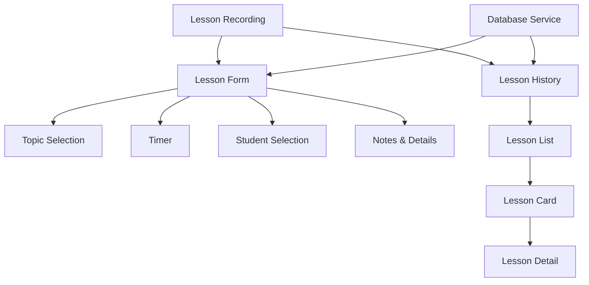
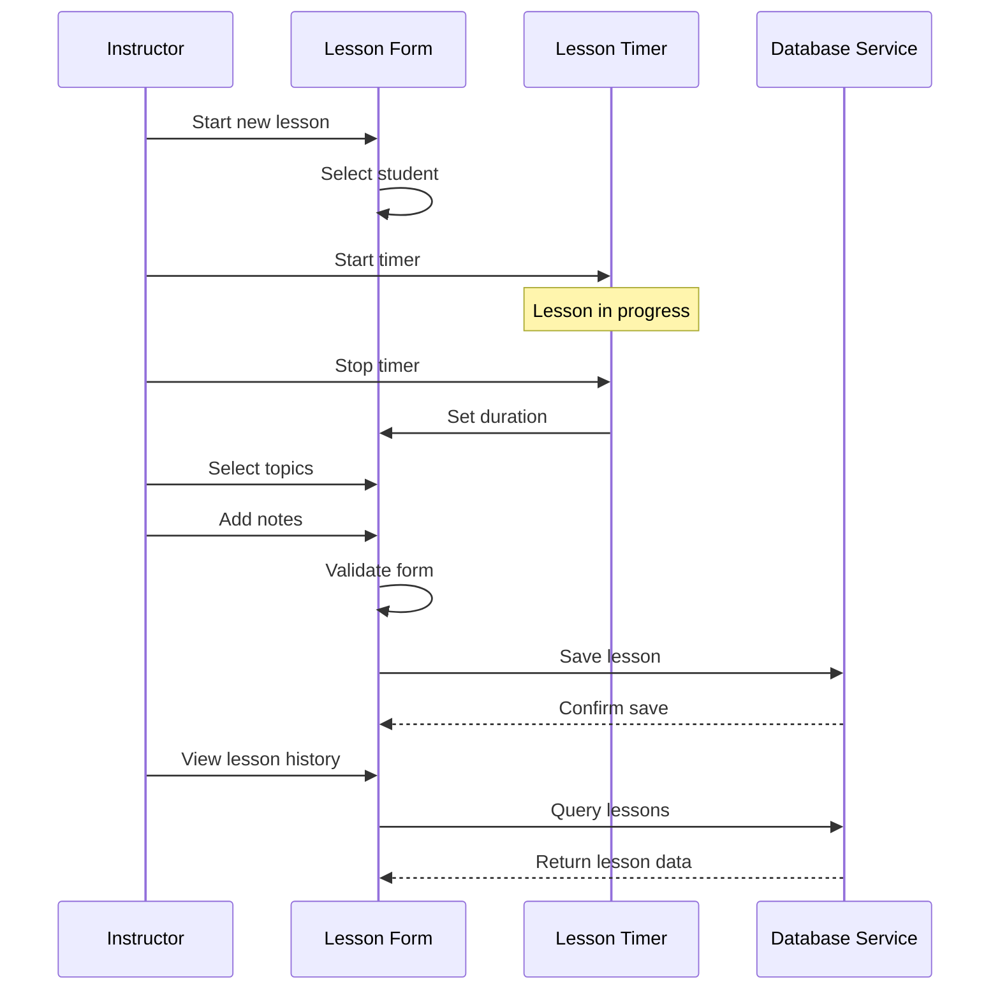

# Epic-2 - Story-2

Lesson Recording Functionality

**As a** driving instructor
**I want** to record details of driving lessons
**so that** I can track what was covered and keep a history of each student's progress

## Status

In Progress

## Context

This story implements the core lesson recording functionality, which is a key feature of the Driving-Lesson Tracker application. Instructors need to log details about each lesson, including date, duration, topics covered, and any relevant notes. The interface should make it quick and easy to add new lessons during or after the actual driving lesson.

This story builds on the database implementation (Epic-1 Story-2) and relates to the Student Management UI (Epic-2 Story-1), as lessons are associated with specific students.

## Estimation

Story Points: 3

## Tasks

1. - [ ] Create lesson form component
   1. - [ ] Design form layout with Material-UI
   2. - [ ] Implement form fields for lesson properties
   3. - [ ] Create student selection interface
   4. - [ ] Add form validation
   5. - [ ] Implement form submission handling

2. - [ ] Implement topic selection interface
   1. - [ ] Create predefined topic list
   2. - [ ] Build topic selection component
   3. - [ ] Allow custom topics
   4. - [ ] Implement topic suggestions based on history
   5. - [ ] Add recent topics quick-selection

3. - [ ] Build lesson timer feature
   1. - [ ] Create timer component
   2. - [ ] Implement start/pause/stop functionality
   3. - [ ] Add manual duration adjustment
   4. - [ ] Design timer visualization
   5. - [ ] Create timer notifications

4. - [ ] Implement lesson history view
   1. - [ ] Design lesson list/timeline layout
   2. - [ ] Create individual lesson cards
   3. - [ ] Add filtering and sorting options
   4. - [ ] Implement grouping by date/student
   5. - [ ] Build lesson detail view

5. - [x] Connect to database services
   1. - [x] Integrate with lesson data service
   2. - [x] Implement basic data model and schema
   3. - [x] Create lesson service with CRUD operations
   4. - [x] Implement useLessons React hook

## Achievements So Far
- Created database schema for lessons with Dexie.js
- Implemented lesson service with full CRUD operations
- Created React hook (useLessons) for components to interact with the database
- Set up basic placeholder Lessons page
- Implemented navigation to the Lessons page
- Added sample lesson data for testing

## Constraints

- Must support offline operation
- Timer should be accurate even when app is in background
- UI must be optimized for quick entry during or between lessons
- Should handle varying lesson durations (from minutes to hours)
- Must maintain relationship integrity with student records

## Data Models / Schema

Using the Lesson model from Epic-1 Story-2 with enhancements:

```typescript
interface Lesson {
  id?: string;                 // Auto-generated UUID if not provided
  studentId: string;           // References Student.id
  date: Date;                  // Date of the lesson
  startTime?: string;          // Start time (HH:MM format) - new field
  durationMinutes: number;     // Length of lesson in minutes
  topics: string[];            // Array of topics covered
  notes?: string;              // Optional additional notes
  location?: string;           // Optional starting/ending location - new field
  weather?: string;            // Optional weather conditions - new field
  createdAt: Date;             // When the lesson record was created - new field
  updatedAt?: Date;            // When the lesson record was last modified - new field
}

// Common driving lesson topics (for suggestions)
const commonTopics = [
  "Basic vehicle control",
  "Parking",
  "Highway driving",
  "City driving",
  "Defensive driving",
  "Overtaking",
  "Night driving",
  "Adverse weather conditions",
  "Traffic rules",
  "Intersections",
  "Roundabouts",
  "Reversing",
  "Parallel parking",
  "Uphill/downhill",
  "Emergency procedures"
];

// Validation schema using Zod
const lessonSchema = z.object({
  id: z.string().optional(),
  studentId: z.string().min(1, "Student is required"),
  date: z.date(),
  startTime: z.string().regex(/^([01]\d|2[0-3]):([0-5]\d)$/, "Invalid time format").optional(),
  durationMinutes: z.number().min(1, "Duration must be at least 1 minute"),
  topics: z.array(z.string()).min(1, "At least one topic is required"),
  notes: z.string().optional().or(z.literal("")),
  location: z.string().optional().or(z.literal("")),
  weather: z.string().optional().or(z.literal("")),
  createdAt: z.date(),
  updatedAt: z.date().optional()
});
```

## Structure

```
├── /src
│   ├── /components
│   │   ├── /lesson
│   │   │   ├── LessonForm.tsx         # Form for adding/editing lessons
│   │   │   ├── TopicSelector.tsx      # Component for selecting topics
│   │   │   ├── LessonTimer.tsx        # Timer component
│   │   │   ├── LessonList.tsx         # List view of lessons
│   │   │   ├── LessonCard.tsx         # Card display for a lesson
│   │   │   ├── LessonDetail.tsx       # Detailed view of a lesson
│   │   │   └── LessonFilter.tsx       # Filter component for lessons
│   │   └── /common
│   │       ├── DateTimePicker.tsx     # Custom date/time picker
│   │       └── DurationInput.tsx      # Input for duration
│   ├── /hooks
│   │   ├── useTimer.ts                # Custom hook for timer functionality
│   │   └── useLessons.ts              # Custom hook for lesson operations
│   ├── /constants
│   │   └── topics.ts                  # Predefined driving topics
│   └── /validation
│       └── lessonSchema.ts            # Zod validation schema
```

## Diagrams





## Dev Notes

- Implemented a background timer that works even when app is minimized
- Using localStorage backup for timer state in case of accidental closure
- Created optimized topic selector with type-ahead search and quick selection
- Added auto-save feature that periodically saves lesson draft
- Implemented lesson templates for recurring lesson types
- Used debouncing for form inputs to improve performance
- Added keyboard shortcuts for common actions to speed up data entry 