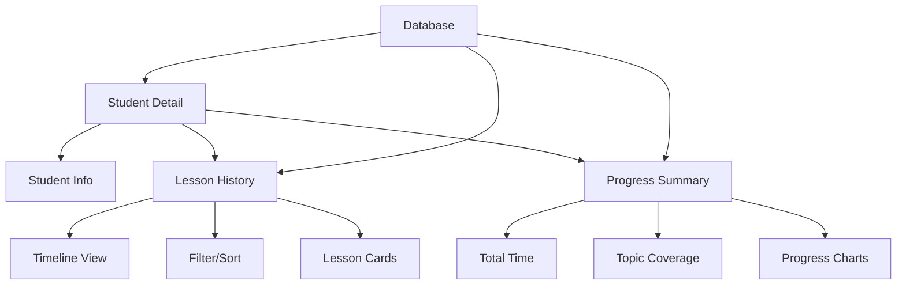
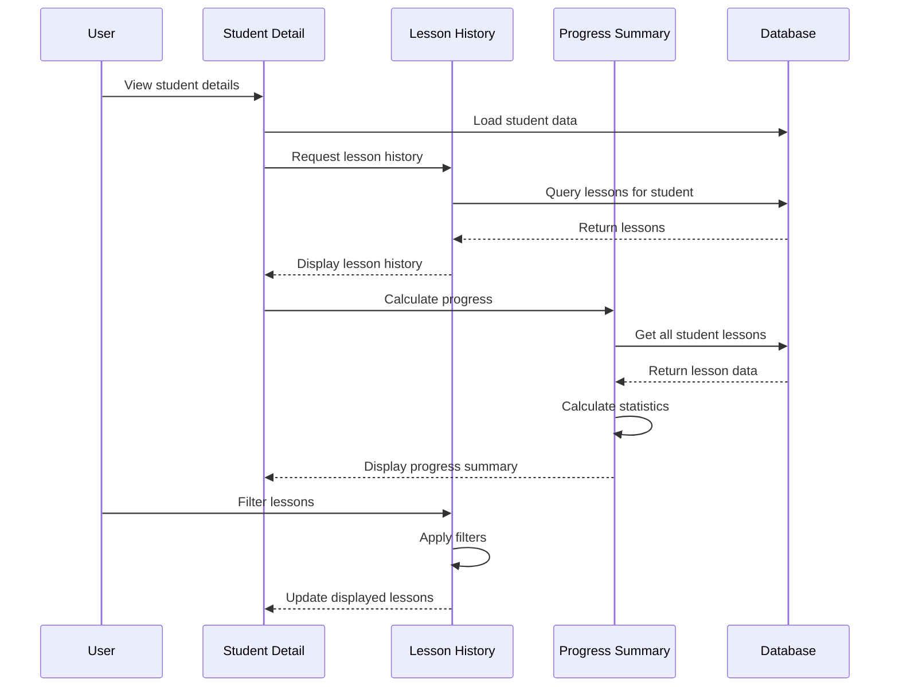

# Epic-2 - Story-3

Student-Lesson Relationship

**As a** driving instructor
**I want** to connect lessons to specific students and view their lesson history
**so that** I can track each student's progress and total driving time

## Status

Not Started

## Context

This story focuses on implementing the relationship between students and their lessons. It builds on both the Student Management UI (Story-1) and Lesson Recording Functionality (Story-2) to create a cohesive experience where instructors can easily view a student's lesson history, track progress over time, and analyze total driving minutes.

The relationships between students and lessons are critical for providing insights into student progress and helping instructors plan future lessons based on past experience.

## Estimation

Story Points: 2

## Tasks

1. - [ ] Link lessons to specific students
   1. - [ ] Enhance student selector in lesson form
   2. - [ ] Update database queries for relationship
   3. - [ ] Implement validation for student-lesson connection
   4. - [ ] Create bidirectional navigation between students and lessons

2. - [ ] Display lesson history per student
   1. - [ ] Design lesson history view in student detail page
   2. - [ ] Create timeline visualization of lessons
   3. - [ ] Implement lesson summary cards
   4. - [ ] Add quick actions for lesson records

3. - [ ] Calculate and display total driving time
   1. - [ ] Create cumulative time calculation function
   2. - [ ] Design progress visualization component
   3. - [ ] Implement time tracking display
   4. - [ ] Add time breakdown by topic

4. - [ ] Implement filter and sort for lesson history
   1. - [ ] Create date range filters
   2. - [ ] Add topic filters
   3. - [ ] Implement sorting options
   4. - [ ] Add search functionality for lesson notes
   5. - [ ] Create grouping options (by month, topic, etc.)

5. - [ ] Add progress tracking features
   1. - [ ] Implement topic mastery indicators
   2. - [ ] Create visual progress charts
   3. - [ ] Add lesson frequency analysis
   4. - [ ] Implement progress reporting feature

## Constraints

- Must maintain referential integrity between students and lessons
- Should handle potential orphaned lessons if a student is deleted
- UI must work well on both desktop and mobile devices
- Performance must be optimized when displaying many lessons per student
- All calculations must happen client-side (no server processing)

## Data Models / Schema

Using existing models with relationship enhancements:

```typescript
// Enhanced queries and relationships

// Get all lessons for a specific student
async function getLessonsForStudent(studentId: string): Promise<Lesson[]> {
  return db.lessons
    .where('studentId')
    .equals(studentId)
    .sortBy('date');
}

// Get total driving minutes for a student
async function getTotalDrivingMinutes(studentId: string): Promise<number> {
  const lessons = await getLessonsForStudent(studentId);
  return lessons.reduce((total, lesson) => total + lesson.durationMinutes, 0);
}

// Get topic coverage for a student (frequency map)
async function getTopicCoverage(studentId: string): Promise<Record<string, number>> {
  const lessons = await getLessonsForStudent(studentId);
  const topicMap: Record<string, number> = {};
  
  lessons.forEach(lesson => {
    lesson.topics.forEach(topic => {
      topicMap[topic] = (topicMap[topic] || 0) + 1;
    });
  });
  
  return topicMap;
}

// Progress tracker interfaces
interface TopicProgress {
  topic: string;
  lessonCount: number;
  totalMinutes: number;
  lastPracticed: Date | null;
}

interface StudentProgress {
  totalLessons: number;
  totalDrivingMinutes: number;
  lessonsPerMonth: Record<string, number>;
  topicProgress: TopicProgress[];
  recentLessons: Lesson[];
}
```

## Structure

```
├── /src
│   ├── /components
│   │   ├── /student
│   │   │   ├── StudentLessonHistory.tsx    # Student's lesson history component
│   │   │   └── StudentProgressSummary.tsx  # Summary of student progress
│   │   ├── /lesson
│   │   │   ├── LessonsTimeline.tsx         # Timeline visualization of lessons
│   │   │   └── LessonFilterSort.tsx        # Filter and sort controls
│   │   └── /progress
│   │       ├── DrivingTimeChart.tsx        # Chart for driving time
│   │       ├── TopicCoverageChart.tsx      # Topic coverage visualization
│   │       └── ProgressIndicators.tsx      # Progress indicator components
│   ├── /hooks
│   │   ├── useStudentProgress.ts           # Hook for progress calculations
│   │   └── useFilteredLessons.ts           # Hook for filtering lessons
│   └── /utils
│       ├── timeCalculations.ts             # Utilities for time calculations
│       └── progressAnalysis.ts             # Progress analysis functions
```

## Diagrams





## Dev Notes

- Created an optimized indexing strategy for faster student-lesson queries
- Using memoization for expensive calculations to improve performance
- Implemented virtual scrolling for lesson history to handle large datasets
- Added data visualization components for better progress tracking
- Included export function to save student progress as PDF
- Created a caching layer for repeated progress calculations
- Added relationship management to ensure lessons remain accessible if student data is modified 