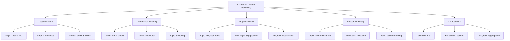
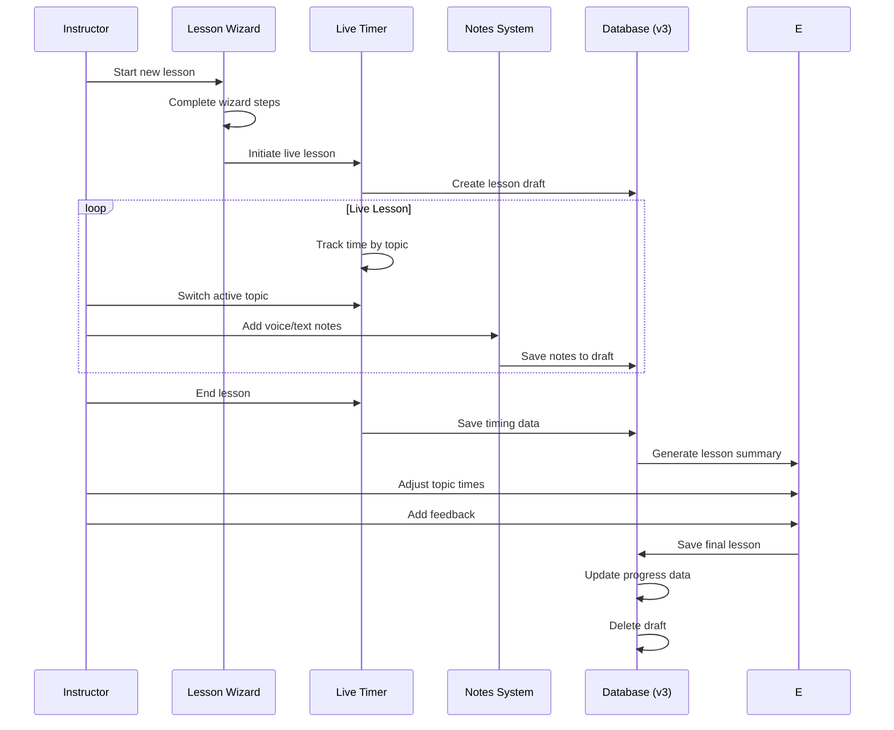

# Epic-3 - Story-1

Enhanced Lesson Recording Experience

**As a** driving instructor
**I want** an intuitive, wizard-style interface for recording driving lessons with real-time progress tracking
**so that** I can efficiently document lessons, track student progress by topic, and plan future lessons more effectively

## Status

In Progress

## Context

This story builds upon the basic lesson recording functionality (Epic-2 Story-2) by introducing a more sophisticated, user-friendly approach to lesson management. The current implementation provides basic functionality for recording lessons, but lacks an intuitive workflow and comprehensive progress tracking. 

The enhanced lesson recording experience will introduce:
1. A step-by-step wizard UI for creating new lessons
2. A progress matrix to visualize student advancement across different driving topics
3. Smart suggestions for next topics based on progress data
4. Improved real-time lesson tracking with voice notes
5. A comprehensive lesson summary screen
6. Extended database schema to support these new features

This enhancement will significantly improve the user experience for instructors while providing more detailed progress tracking for students.

## Estimation

Story Points: 5

## Tasks

1. - [x] Develop Wizard UI for lesson creation
   1. - [x] Design 3-step Stepper component (Basic info → Select exercises → Goals & notes)
   2. - [x] Implement stepper navigation (next/back/submit)
   3. - [x] Create form validation for each step
   4. - [x] Add progress indicators and summary preview
   5. - [x] Implement responsive design for mobile and desktop views

2. - [x] Build Progress Matrix dashboard
   1. - [x] Design table listing each topic with statistics (recommended minutes, completed minutes, percentage, remaining)
   2. - [x] Implement color-coding system (red/yellow/green) based on completion percentages
   3. - [x] Create progress aggregation functions to calculate statistics
   4. - [ ] Add filtering and sorting options for the matrix view
   5. - [x] Design compact view for mobile devices

3. - [ ] Implement topic recommendation system
   1. - [ ] Develop "Suggest next topic" algorithm that highlights topics with <50% completion
   2. - [ ] Add recency factor to prioritize topics without recent practice
   3. - [ ] Create visual indicators for suggested topics in the selection interface
   4. - [ ] Implement suggestion explanation tooltips
   5. - [ ] Build override controls for instructor preferences

4. - [ ] Create enhanced Live Lesson Timer component
   1. - [ ] Redesign timer UI with start/pause/stop controls
   2. - [ ] Implement real-time duration tracking stored in React Context
   3. - [ ] Add topic switching during active timer
   4. - [ ] Create elapsed time breakdown by topic
   5. - [ ] Build notifications/reminders for long sessions

5. - [ ] Add quick note-taking functionality
   1. - [ ] Integrate voice note recording using Web Speech API
   2. - [ ] Implement fallback to text input when speech recognition is unavailable
   3. - [ ] Create note categorization (instructor notes vs. student feedback)
   4. - [ ] Add timestamp linking notes to specific moments in the lesson
   5. - [ ] Build note review and edit interface

6. - [ ] Develop Lesson Summary screen
   1. - [ ] Design post-lesson review interface
   2. - [ ] Add controls to adjust actual minutes per topic
   3. - [ ] Create separate instructor and student feedback sections
   4. - [ ] Implement progress visualization based on completed topics
   5. - [ ] Add next-lesson scheduling suggestions

7. - [ ] Extend database schema for enhanced functionality
   1. - [ ] Create `LessonDraft` table for ongoing/in-progress lessons
   2. - [ ] Update `Lesson` table with additional fields for the enhanced data model
   3. - [ ] Develop progress aggregation selectors and queries
   4. - [ ] Implement data migration strategy for existing lessons
   5. - [ ] Add sync/cleanup procedures for draft lessons

8. - [ ] Update Student Dashboard
   1. - [ ] Integrate Progress Matrix into student view
   2. - [ ] Add prominent "Add Lesson" button linking to Wizard
   3. - [ ] Create progress summary cards for quick overview
   4. - [ ] Implement time-based progress charts
   5. - [ ] Add milestone tracking based on topic completion

9. - [ ] Build improved lesson history view
   1. - [ ] Implement History view with enhanced filters (phase, date range)
   2. - [ ] Add "Duplicate lesson" action for repetitive lessons
   3. - [ ] Create calendar view option for lesson history
   4. - [ ] Design detailed lesson review screen
   5. - [ ] Add export functionality for lesson history

10. - [ ] Develop tests and documentation
    1. - [ ] Write unit tests for progress aggregation logic
    2. - [ ] Create tests for suggest-next-topic algorithm
    3. - [ ] Develop integration tests for the Wizard flow
    4. - [ ] Update user documentation with new features
    5. - [ ] Create sample data for demonstration purposes

## Constraints

- Must maintain offline-first functionality
- UI must be responsive and work well on both mobile and desktop
- Should maintain backward compatibility with existing lesson data
- Voice recording feature must gracefully degrade when unavailable
- Progress calculations must be accurate and performant even with large datasets
- Should adhere to the Finnish driving curriculum structure

## Data Models / Schema

Extended schema (version 3) with new tables and fields:

```typescript
// New intermediary table for in-progress lessons
export interface LessonDraft {
  id?: number;
  studentId: number;
  date: Date;
  startTime: string;
  currentDuration: number; // Current elapsed time in seconds
  activeTopicId: string;   // Currently active topic
  topicTimings: {          // Time spent on each topic so far
    topicId: string;
    seconds: number;
  }[];
  notes: {                 // Quick notes added during the lesson
    timestamp: number;     // When the note was added (seconds from start)
    content: string;
    type: 'voice' | 'text';
    forStudent: boolean;   // Whether this note should be shared with student
  }[];
  createdAt: Date;
  lastUpdated: Date;
}

// Extended Lesson interface
export interface Lesson extends Omit<LessonDraft, 'currentDuration' | 'activeTopicId'> {
  id?: number;
  endTime: string;
  learningStage: LearningStage;
  completed: boolean;
  topicBreakdown: {        // Final breakdown of time spent on topics
    topicId: string;
    minutes: number;
    progressPercent: number; // Calculated progress for this topic
  }[];
  instructorFeedback: string;
  studentFeedback: string;
  nextLessonFocus: string[];
  updatedAt: Date;
}

// Progress tracking
export interface TopicProgress {
  topicId: string;
  recommendedMinutes: number;
  completedMinutes: number;
  lastPracticed: Date | null;
  progressPercent: number;
}
```

## Structure

```
├── /src
│   ├── /components
│   │   ├── /lesson
│   │   │   ├── wizard/
│   │   │   │   ├── LessonWizard.tsx           # Main wizard container
│   │   │   │   ├── BasicInfoStep.tsx          # Step 1: Basic lesson info
│   │   │   │   ├── ExercisesStep.tsx          # Step 2: Topic selection
│   │   │   │   ├── GoalsNotesStep.tsx         # Step 3: Goals and notes
│   │   │   │   └── WizardSummary.tsx          # Lesson summary preview
│   │   │   ├── timer/
│   │   │   │   ├── LiveLessonTimer.tsx        # Enhanced timer with context
│   │   │   │   ├── TopicSwitcher.tsx          # Topic switching during timer
│   │   │   │   ├── TimerControls.tsx          # Start/pause/stop controls
│   │   │   │   └── TimeBreakdown.tsx          # Topic time breakdown
│   │   │   ├── notes/
│   │   │   │   ├── QuickNoteInput.tsx         # Voice/text note component
│   │   │   │   ├── NotesList.tsx              # Display for recorded notes
│   │   │   │   └── VoiceRecorder.tsx          # Speech recognition wrapper
│   │   │   ├── progress/
│   │   │   │   ├── ProgressMatrix.tsx         # Topic progress table
│   │   │   │   ├── TopicSuggestion.tsx        # Next topic suggestion UI
│   │   │   │   └── ProgressIndicator.tsx      # Visual progress indicator
│   │   │   ├── summary/
│   │   │   │   ├── LessonSummary.tsx          # Post-lesson summary screen
│   │   │   │   ├── TopicAdjustment.tsx        # Adjust minutes per topic
│   │   │   │   └── FeedbackForm.tsx           # Instructor/student feedback
│   │   │   └── history/
│   │   │       ├── EnhancedLessonHistory.tsx  # Improved history view
│   │   │       ├── LessonFilters.tsx          # Advanced filtering options
│   │   │       └── LessonDuplicator.tsx       # Duplicate lesson functionality
│   │   └── /student
│   │       └── ProgressDashboard.tsx          # Student progress view
│   ├── /context
│   │   └── LessonTimerContext.tsx             # Context for active lesson
│   ├── /hooks
│   │   ├── useProgressCalculation.ts          # Hook for progress calculations
│   │   ├── useTopicSuggestion.ts              # Hook for topic suggestions
│   │   ├── useVoiceInput.ts                   # Hook for speech recognition
│   │   └── useLessonDraft.ts                  # Hook for draft lesson operations
│   └── /services
│       └── db.ts                              # Updated Dexie schema (v3)
```

## Diagrams





## Dev Notes

- Consider using React Context for sharing timer state across components
- Use the Web Speech API with a text fallback for voice notes
- The Progress Matrix should use client-side calculations to maintain offline functionality
- Consider implementing optimistic UI updates for a smoother user experience
- Ensure that lesson drafts are properly cleaned up if abandoned
- Progress calculations should be cached to avoid recalculating on each render
- Add local notifications for timer functionality when app is in background
- Consider a worker for handling timing when the app is not in focus 