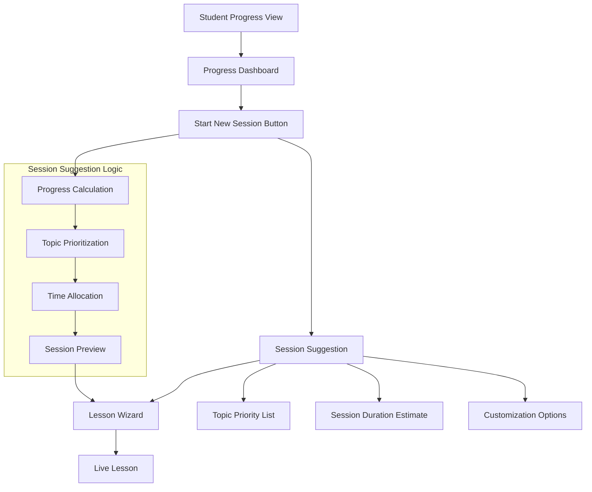
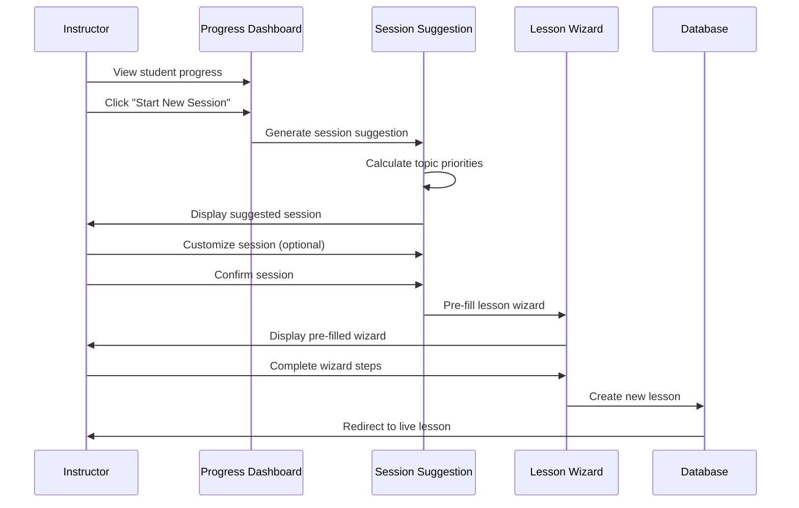

# Epic-3 - Story-2

Smart Session Creation from Student Progress View

**As a** driving instructor
**I want** to start a new learning session directly from the student progress dashboard
**so that** I can efficiently focus on the topics that need the most attention for each student

## Status

Not Started

## Context

This story builds upon the Progress Dashboard functionality (Epic-3 Story-1) by allowing instructors to quickly start new learning sessions based on student progress data. Currently, instructors need to manually create a new lesson and select topics separately from viewing the student's progress. This creates unnecessary friction in the workflow.

The enhanced feature will:
1. Add a "Start New Session" button in the Progress Dashboard dialog
2. Automatically pre-select topics that need attention based on progress data
3. Pre-fill the lesson form with the selected student and suggested topics
4. Show prioritized topics with their remaining time requirements
5. Allow instructors to quickly begin a focused learning session

This enhancement will significantly improve the workflow efficiency for instructors by connecting progress data directly to action, ensuring that students practice the topics they need the most.

## Estimation

Story Points: 3

## Tasks

1. - [ ] Add "Start New Session" button to Progress Dashboard
   1. - [ ] Create prominent CTA button in the Progress Dashboard dialog
   2. - [ ] Add button click handler to initiate session creation
   3. - [ ] Add tooltip with explanation of the feature
   4. - [ ] Implement responsive design for button placement
   5. - [ ] Add loading state for button when clicked

2. - [ ] Implement topic recommendation logic
   1. - [ ] Enhance `useProgressCalculation` hook with prioritization logic
   2. - [ ] Create algorithm to select topics based on lowest progress percentages
   3. - [ ] Add fallback for students with no previous lessons
   4. - [ ] Add recency factor to prioritize topics without recent practice
   5. - [ ] Create tests for the recommendation algorithm

3. - [ ] Build session pre-fill functionality
   1. - [ ] Modify LessonWizard to accept pre-selected student and topics
   2. - [ ] Create service function to generate session from progress data
   3. - [ ] Implement navigation from progress view to pre-filled lesson wizard
   4. - [ ] Add ability to modify pre-selected topics in the wizard
   5. - [ ] Preserve student context throughout the wizard flow

4. - [ ] Create session preview component
   1. - [ ] Design preview card showing prioritized topics
   2. - [ ] Add estimated session duration based on remaining minutes
   3. - [ ] Implement collapsible detailed view for all suggested topics
   4. - [ ] Create visual indicators for topic priority levels
   5. - [ ] Add ability to customize the suggested session before starting

5. - [ ] Implement data persistence and state management
   1. - [ ] Create temporary session storage in local state or context
   2. - [ ] Add persistence for partially created sessions
   3. - [ ] Implement clean-up for abandoned session drafts
   4. - [ ] Add session recovery on app restart
   5. - [ ] Create proper error handling for session creation failures

6. - [ ] Add session optimization features
   1. - [ ] Implement time-based session optimization (30, 45, 60, 90 min options)
   2. - [ ] Add focus area selection (cognitive, associative, automatic stages)
   3. - [ ] Create "balanced session" option that includes topics from multiple stages
   4. - [ ] Implement adaptive suggestions based on student learning style
   5. - [ ] Add instructor preference settings for session creation

7. - [ ] Enhance UI feedback and guidance
   1. - [ ] Create inline help text explaining the suggested topics
   2. - [ ] Add progress visualization in the session preview
   3. - [ ] Implement confirmation dialog with session summary
   4. - [ ] Create success/failure notifications
   5. - [ ] Add guided tour for the new feature

## Constraints

- Must work seamlessly with the existing Progress Dashboard
- Should maintain offline-first functionality
- UI must be responsive and work well on both mobile and desktop
- Topic selection algorithm must be efficient even with large datasets
- Must adhere to the Finnish driving curriculum structure
- User should never lose work when creating a session

## Data Models / Schema

No new database schema changes are required for this feature, as it utilizes existing models:

```typescript
// Existing models to be used
import { Student, Lesson, LessonDraft } from '../services/db';
import { TopicProgress } from '../hooks/useProgressCalculation';

// New interfaces for the feature (not stored in DB)
interface SessionSuggestion {
  studentId: number;
  studentName: string;
  suggestedTopics: {
    topicId: string;
    topicLabel: string;
    stage: LearningStage;
    priorityLevel: 'high' | 'medium' | 'low';
    remainingMinutes: number;
    progressPercent: number;
  }[];
  estimatedDuration: number; // in minutes
  createdAt: Date;
}
```

## Structure

```
├── /src
│   ├── /components
│   │   ├── /student
│   │   │   ├── ProgressDashboard.tsx       # Modified with new button
│   │   │   └── SessionStarter.tsx          # New component for starting sessions
│   │   ├── /session
│   │   │   ├── SessionSuggestionCard.tsx   # Display suggested session
│   │   │   ├── TopicPriorityList.tsx       # List of prioritized topics
│   │   │   ├── SessionConfigOptions.tsx    # Options for customizing session
│   │   │   └── SessionPreview.tsx          # Preview of session to be created
│   │   └── /lesson
│   │       └── wizard/
│   │           └── LessonWizard.tsx        # Modified to accept pre-selections
│   ├── /hooks
│   │   ├── useProgressCalculation.ts       # Enhanced with prioritization
│   │   ├── useSessionSuggestion.ts         # New hook for session suggestions
│   │   └── useSessionCreation.ts           # Hook for creating new sessions
│   └── /services
│       └── sessionService.ts               # Service for session operations
```

## Diagrams





## Dev Notes

- Consider using React Context for sharing session state
- Use the `useProgressCalculation` hook as a foundation for topic suggestions
- Pre-calculation of suggestions should be done outside render cycle for performance
- Add clear error handling for cases where data is unavailable
- Consider adding a notification system for reminding instructors about overdue topics
- Add analytics to track the effectiveness of suggested sessions
- Ensure mobile experience is optimized for quick session creation 