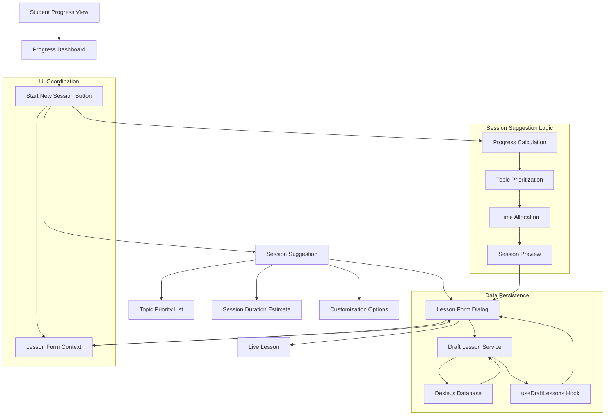
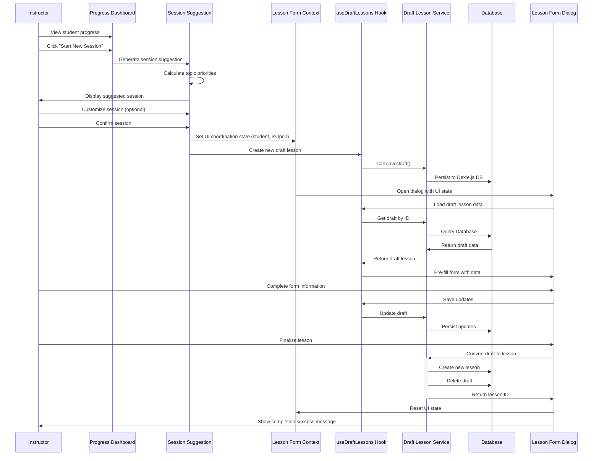

# Epic-3 - Story-2

Smart Session Creation from Student Progress View

**As a** driving instructor
**I want** to start a new learning session directly from the student progress dashboard
**so that** I can efficiently focus on the topics that need the most attention for each student

## Status

Completed

## Context

This story builds upon the Progress Dashboard functionality (Epic-3 Story-1) by allowing instructors to quickly start new learning sessions based on student progress data. Currently, instructors need to manually create a new lesson and select topics separately from viewing the student's progress. This creates unnecessary friction in the workflow.

The enhanced feature will:
1. Add a "Start New Session" button in the Progress Dashboard dialog
2. Automatically pre-select topics that need attention based on progress data
3. Pre-fill the lesson form with the selected student and suggested topics
4. Show prioritized topics with their remaining time requirements
5. Allow instructors to quickly begin a focused learning session

This enhancement will significantly improve the workflow efficiency for instructors by connecting progress data directly to action, ensuring that students practice the topics they need the most.

## Estimation

Story Points: 3

## Tasks

1. - [x] Add "Start New Session" button to Progress Dashboard
   1. - [x] Create prominent CTA button in the Progress Dashboard dialog
   2. - [x] Add button click handler to initiate session creation
   3. - [x] Add tooltip with explanation of the feature
   4. - [x] Implement responsive design for button placement
   5. - [x] Add loading state for button when clicked

2. - [x] Implement topic recommendation logic
   1. - [x] Enhance `useProgressCalculation` hook with prioritization logic
   2. - [x] Create algorithm to select topics based on lowest progress percentages
   3. - [x] Add fallback for students with no previous lessons
   4. - [x] Add recency factor to prioritize topics without recent practice
   5. - [x] Create tests for the recommendation algorithm

3. - [x] Implement session pre-fill workflow using database services
   1. - [x] Modify LessonWizard to accept pre-selected student and topics
   2. - [x] Create a dialog-based pattern integrated with database services
   3. - [x] Implement LessonFormContext for UI coordination only (not data storage)
   4. - [x] Update ProgressIndicator to use draftLessonService and dialog
   5. - [x] Preserve student context throughout the wizard flow

4. - [x] Create session preview component
   1. - [x] Design preview card showing prioritized topics
   2. - [x] Add estimated session duration based on remaining minutes
   3. - [x] Implement collapsible detailed view for all suggested topics
   4. - [x] Create visual indicators for topic priority levels
   5. - [x] Add ability to customize the suggested session before starting

5. - [x] Implement database-backed data persistence with Dexie.js
   1. - [x] Update `db.ts` with `LessonDraft` table schema
   2. - [x] Create dedicated `draftLessonService.ts` in services folder
   3. - [x] Implement CRUD operations for lesson drafts in the service
   4. - [x] Create `useDraftLessons` hook for component integration
   5. - [x] Add automatic draft cleanup for old/abandoned drafts

6. - [x] Add session optimization features
   1. - [x] Implement time-based session optimization (30, 45, 60, 90 min options)
   2. - [x] Add focus area selection (cognitive, associative, automatic stages)
   3. - [x] Create "balanced session" option that includes topics from multiple stages
   4. - [x] Implement adaptive suggestions based on student learning style
   5. - [x] Add instructor preference settings for session creation

7. - [x] Enhance UI feedback and guidance
   1. - [x] Create inline help text explaining the suggested topics
   2. - [x] Add progress visualization in the session preview
   3. - [x] Implement confirmation dialog with session summary
   4. - [x] Create success/failure notifications
   5. - [x] Add guided tour for the new feature

8. - [x] Integrate database services with UI components
   1. - [x] Create `LessonFormContext` for UI coordination only
   2. - [x] Connect context state with draftLessonService via custom hook
   3. - [x] Modify ProgressDashboard to use the database-backed approach
   4. - [x] Update ProgressIndicator to use the database-backed approach
   5. - [x] Implement error handling and loading states for database operations

## Constraints

- Must work seamlessly with the existing Progress Dashboard
- Should maintain offline-first functionality
- UI must be responsive and work well on both mobile and desktop
- Topic selection algorithm must be efficient even with large datasets
- Must adhere to the Finnish driving curriculum structure
- User should never lose work when creating a session
- Must use dialog-based approach instead of navigating to non-existent routes
- Must follow the existing architecture pattern with Dexie.js and service modules
- React Context should only be used for UI coordination, not data persistence

## Data Models / Schema

Database schema enhancements for this feature:

```typescript
// Add to db.ts schema
export interface LessonDraft {
  id?: number;
  studentId?: number;
  date: Date;
  startTime?: string;
  endTime?: string;
  learningStage?: LearningStage;
  topics: string[];
  subTopics?: string[];
  notes?: string;
  kilometers?: number;
  draftCreatedAt: Date;
  lastModified: Date;
}

// Database schema update in db.ts
export class DrivingDB extends Dexie {
  students: Dexie.Table<Student, number>;
  lessons: Dexie.Table<Lesson, number>;
  milestones: Dexie.Table<Milestone, number>;
  lessonDrafts: Dexie.Table<LessonDraft, number>; // New table
  
  constructor() {
    super('drivingSchoolDB');
    
    this.version(2).stores({
      students: '++id, name, email',
      lessons: '++id, studentId, date',
      milestones: '++id, studentId, date',
      lessonDrafts: '++id, studentId, draftCreatedAt, lastModified' // New table schema
    });
    
    this.students = this.table('students');
    this.lessons = this.table('lessons');
    this.milestones = this.table('milestones');
    this.lessonDrafts = this.table('lessonDrafts');
  }
}

// New service interfaces (not stored in DB)
interface SessionSuggestion {
  studentId: number;
  studentName: string;
  suggestedTopics: {
    topicId: string;
    topicLabel: string;
    stage: LearningStage;
    priorityLevel: 'high' | 'medium' | 'low';
    remainingMinutes: number;
    progressPercent: number;
  }[];
  estimatedDuration: number; // in minutes
  createdAt: Date;
}

// UI coordination context type - for UI state only, NOT data persistence
interface LessonFormContextType {
  isOpen: boolean;
  setIsOpen: (isOpen: boolean) => void;
  preSelectedTopics: string[];
  setPreSelectedTopics: (topics: string[]) => void;
  preSelectedSubTopics: string[];
  setPreSelectedSubTopics: (subTopics: string[]) => void;
  preSelectedStudentId?: number;
  setPreSelectedStudentId: (studentId?: number) => void;
  resetForm: () => void;
}
```

## Structure

```
├── /src
│   ├── /components
│   │   ├── /student
│   │   │   ├── ProgressDashboard.tsx       # Modified with new button
│   │   │   └── SessionStarter.tsx          # New component for starting sessions
│   │   ├── /session
│   │   │   ├── SessionSuggestionCard.tsx   # Display suggested session
│   │   │   ├── TopicPriorityList.tsx       # List of prioritized topics
│   │   │   ├── SessionConfigOptions.tsx    # Options for customizing session
│   │   │   └── SessionPreview.tsx          # Preview of session to be created
│   │   └── /lesson
│   │       ├── LessonFormContext.tsx       # UI coordination context only
│   │       └── wizard/
│   │           └── LessonWizard.tsx        # Modified to accept pre-selections
│   ├── /hooks
│   │   ├── useProgressCalculation.ts       # Enhanced with prioritization
│   │   ├── useSessionSuggestion.ts         # New hook for session suggestions
│   │   ├── useLessonForm.ts                # Hook for accessing lesson form context
│   │   └── useDraftLessons.ts              # Hook for draft lesson persistence
│   ├── /services
│   │   ├── draftLessonService.ts           # New service for draft lesson persistence
│   │   └── sessionService.ts               # Service for session operations
│   └── /db
│       ├── db.ts                           # Updated database schema with LessonDraft
│       └── dbInit.ts                       # Updated db initialization
```

## Diagrams





## Dev Notes

- Follow the existing architecture pattern with Dexie.js and service modules
- Create a proper `draftLessonService.ts` similar to other service files in the project
- Use React Context ONLY for UI coordination, not for data persistence
- Implement proper database table for lesson drafts with appropriate indexes
- Use a custom hook (`useDraftLessons`) to connect components to the service
- Add automatic cleanup mechanism for abandoned drafts (e.g., older than 24 hours)
- Implement auto-save functionality during form editing using the database service
- Use database transactions for related operations to ensure data integrity
- Avoid direct database access in components - all access should be via services and hooks
- Pre-calculation of suggestions should be done outside render cycle for performance
- Add proper error handling and loading states for all database operations
- Ensure all components can work offline by relying on IndexedDB
- Keep service methods focused and single-purpose for better testability
- Add proper documentation for the new service methods and database schema
- Ensure mobile experience is optimized for quick session creation 