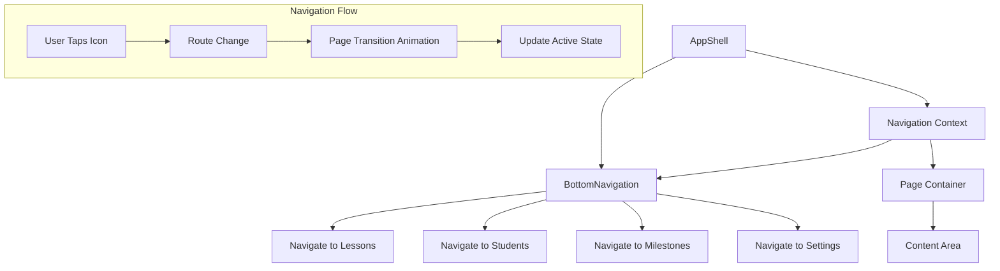
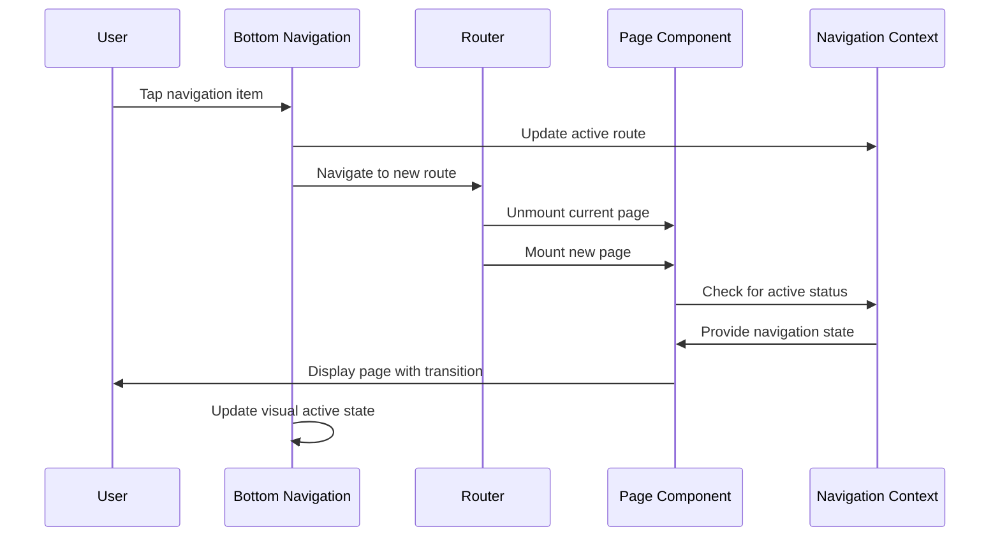

# Epic-3 - Story-3

Enhanced Mobile Navigation Experience

**As a** driving instructor
**I want** an optimized mobile navigation experience with intuitive bottom navigation
**so that** I can easily access all key app features on my phone while teaching driving lessons

## Status

In Progress

## Context

This story focuses on optimizing the mobile experience of the app, particularly enhancing the bottom navigation component that already exists in `src/components/layout/BottomNavigation.tsx`. Mobile usage is a key requirement for the app, as driving instructors need to record data and access information while away from their desks.

The current implementation provides basic bottom navigation, but needs improvements to ensure it follows Material UI v7 standards, provides proper visual feedback, and integrates seamlessly with the application's routing system. Additionally, the navigation should remain accessible even when working with forms and dialogs.

The enhanced mobile navigation will:
1. Optimize the existing BottomNavigation component for better usability
2. Ensure proper active state styling when navigating between routes
3. Include transition animations for smooth page switching
4. Implement proper safe area handling for modern mobile devices
5. Add visual feedback (ripple effects, active indicators)
6. Ensure consistent integration with app-wide theme and styling

This enhancement will significantly improve the mobile experience for instructors, making it easier to switch between key app sections while teaching.

## Estimation

Story Points: 2

## Tasks

1. - [x] Improve BottomNavigation component
   1. - [x] Update to follow MUI v7 component standards
   2. - [x] Fix active state styling using `useLocation` hook
   3. - [x] Ensure proper fixed positioning at bottom of viewport
   4. - [x] Add proper safe area insets for modern mobile devices
   5. - [x] Implement consistent theme integration

2. - [ ] Enhance navigation transitions
   1. - [ ] Add slide transitions between pages
   2. - [ ] Implement fade-in animations for active routes
   3. - [ ] Create smooth ripple effect for button presses
   4. - [ ] Ensure transitions respect reduced motion preferences
   5. - [ ] Test transitions on different mobile devices

3. - [ ] Improve navigation accessibility
   1. - [ ] Add proper aria attributes to navigation items
   2. - [ ] Implement focus states for keyboard navigation
   3. - [ ] Ensure proper contrast ratios for all navigation elements
   4. - [ ] Add screen reader support for navigation items
   5. - [ ] Test with various accessibility tools

4. - [ ] Optimize navigation behavior with forms
   1. - [ ] Ensure bottom navigation remains accessible when keyboard is open
   2. - [ ] Implement auto-scroll behavior when form fields are focused
   3. - [ ] Add temporary navigation hiding option during complex form tasks
   4. - [ ] Create "back to form" indicator when navigating away from unfinished forms
   5. - [ ] Implement proper form state preservation during navigation

5. - [ ] Add visual enhancements
   1. - [ ] Create custom SVG icons for better visual hierarchy
   2. - [ ] Implement badge indicators for notifications or counters
   3. - [ ] Add subtle animation for icon state changes
   4. - [ ] Optimize touch targets for all navigation elements
   5. - [ ] Ensure proper dark mode support for all navigation elements

## Constraints

- Must adhere to Material UI v7 standards and guidelines
- Should maintain all existing functionality of the current navigation
- Performance must be optimized for lower-end mobile devices
- Should gracefully handle different screen sizes and orientations
- Must follow the accessibility guidelines (WCAG 2.1 AA)
- Visual design must be consistent with the overall app theme

## Implementation Details

The implementation will focus on enhancing the existing BottomNavigation component rather than creating a new one from scratch. The component already has the basic structure in place, but needs refinements to improve the user experience.

```typescript
// Current component structure (to be enhanced)
import React from 'react';
import { Paper, BottomNavigation, BottomNavigationAction } from '@mui/material';
import {
  DirectionsCar as LessonsIcon,
  Person as StudentsIcon,
  EmojiEvents as MilestonesIcon,
  Settings as SettingsIcon,
} from '@mui/icons-material';
import { useTranslation } from 'react-i18next';
import { useLocation, useNavigate } from 'react-router-dom';

const AppBottomNavigation: React.FC = () => {
  const { t } = useTranslation(['common']);
  const location = useLocation();
  const navigate = useNavigate();
  
  // Get current path for the active state
  const currentPath = location.pathname.split('/')[1] || 'lessons';

  // Handle navigation
  const handleChange = (event: React.SyntheticEvent, newValue: string) => {
    navigate(`/${newValue}`);
  };

  return (
    <Paper
      sx={{
        position: 'fixed',
        bottom: 0,
        left: 0,
        right: 0,
        zIndex: 1000,
        paddingBottom: 'var(--safe-area-inset-bottom)',
      }}
      elevation={3}
    >
      <BottomNavigation
        value={currentPath}
        onChange={handleChange}
        showLabels
      >
        <BottomNavigationAction
          label={t('navigation.lessons')}
          value="lessons"
          icon={<LessonsIcon />}
        />
        <BottomNavigationAction
          label={t('navigation.students')}
          value="students"
          icon={<StudentsIcon />}
        />
        <BottomNavigationAction
          label={t('navigation.milestones')}
          value="milestones"
          icon={<MilestonesIcon />}
        />
        <BottomNavigationAction
          label={t('navigation.settings')}
          value="settings"
          icon={<SettingsIcon />}
        />
      </BottomNavigation>
    </Paper>
  );
};

export default AppBottomNavigation;
```

## Structure

```
├── /src
│   ├── /components
│   │   ├── /layout
│   │   │   ├── BottomNavigation.tsx          # Enhanced mobile navigation
│   │   │   ├── NavigationTransition.tsx      # Page transition component
│   │   │   ├── NavigationContext.tsx         # Context for navigation state
│   │   │   ├── AppShell.tsx                  # Modified to support enhanced navigation
│   │   │   └── Sidebar.tsx                   # Desktop navigation (unchanged)
│   │   ├── /common
│   │   │   ├── PageContainer.tsx             # Container with navigation awareness
│   │   │   └── SafeAreaProvider.tsx          # Safe area context provider
│   │   └── /animations
│   │       ├── SlideTransition.tsx           # Slide animation between pages
│   │       └── FadeTransition.tsx            # Fade animation for content
│   └── /hooks
│       ├── useNavigationState.ts             # Hook for navigation context
│       └── useSafeArea.ts                    # Hook for safe area calculations
```

## Diagrams





## Dev Notes

- Focus on making the existing component adhere to MUI v7 standards, especially the updated Grid properties
- Use the `sx` prop for styling rather than styled components for consistency
- Ensure all icons have proper touch targets (minimum 48x48px) for mobile usability
- Consider adding a subtle haptic feedback for navigation actions if the browser supports it
- Test with the iOS virtual home indicator to ensure it doesn't overlap with navigation
- Use React.memo to optimize rendering performance for navigation elements
- Consider adding swipe gestures for page switching as a future enhancement
- Ensure transition animations run at 60fps even on lower-end devices
``` 