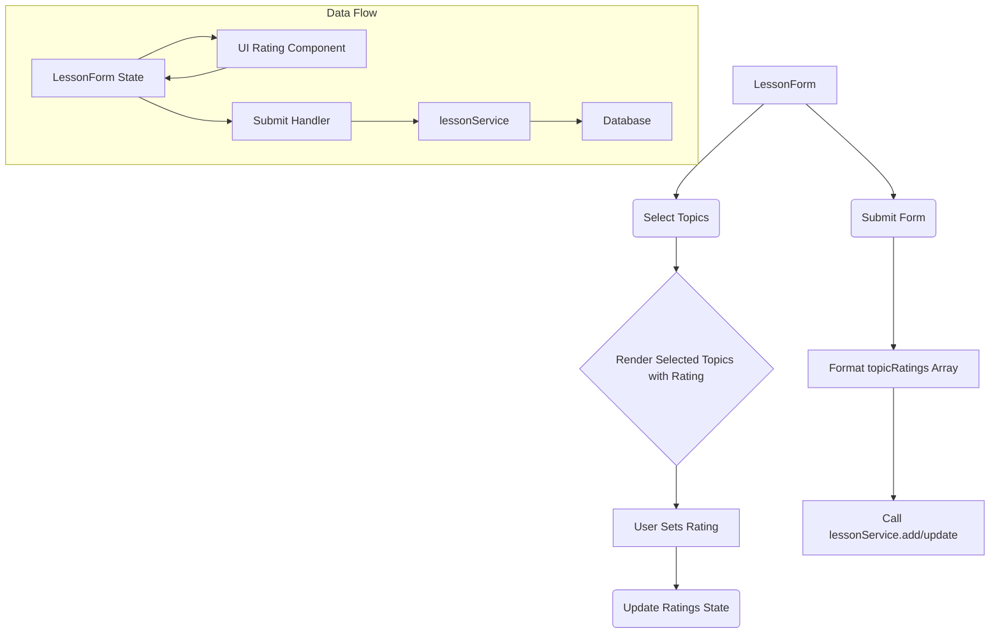
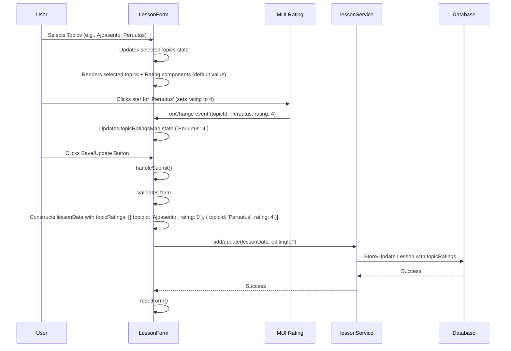

# Epic-4 - Story-1

Topic Performance Rating within Lessons

**As a** driving instructor
**I want** to rate the student's performance on each specific topic covered during a lesson using a 1-5 scale
**so that** I can track detailed progress more effectively and identify specific areas needing improvement.

## Status

To Do

## Context

Currently, the application only tracks which topics were covered in a lesson. This story introduces a rating system (1-5) for each topic within a lesson. This allows instructors to record not just *what* was practiced, but *how well* the student performed on that topic during that specific session.

This enhancement requires changes to:
1.  **Data Model:** Modify the `Lesson` structure in the database (`db.ts`) to store topic ratings instead of just topic keys.
2.  **Lesson Form:** Update the `LessonForm.tsx` UI to include MUI `Rating` components for each selected topic.
3.  **Data Service:** Ensure `lessonService.ts` handles the new data structure for adding and updating lessons.
4.  **Progress Calculation (Future):** The `useProgressCalculation` hook and associated components (`ProgressDashboard`, `ProgressMatrix`) will eventually need to be updated to utilize these ratings for more nuanced progress visualization and analysis.

This feature provides a more granular view of student progress, enabling better-targeted feedback and lesson planning.

## Estimation

Story Points: 3 (Includes data model change, UI update, and service update. Does not include progress visualization updates.)

## Tasks

1.  - [ ] Update Database Schema (`db.ts`)
    1.  - [ ] Modify the `Lesson` interface: replace `topics: string[]` with `topicRatings: { topicId: string; rating: number }[]`.
    2.  - [ ] Update the Dexie table schema definition for `lessons` to reflect the change (`lessons: '++id, studentId, date, &[studentId+date+startTime], learningStage, *topicRatings.topicId, completed'` or similar, ensuring indexing on `topicId` within the array is handled correctly if needed).
    3.  - [ ] Consider data migration strategy if existing lesson data needs to be preserved/converted (may be deferred if app is not yet in production).

2.  - [ ] Update Lesson Form UI (`LessonForm.tsx`)
    1.  - [ ] Keep the existing topic multi-select field.
    2.  - [ ] Add state to manage the ratings for the currently selected topics (e.g., `useState<Record<string, number>>({})`).
    3.  - [ ] Below the topic selection, dynamically render the list of selected topics.
    4.  - [ ] For each selected topic, display its label and an MUI `Rating` component (1-5 stars).
    5.  - [ ] Ensure the `Rating` component updates the internal ratings state.
    6.  - [ ] Initialize ratings (e.g., to 0 or a default value) when topics are selected or when editing a lesson.

3.  - [ ] Update Form Submission Logic (`LessonForm.tsx`)
    1.  - [ ] Modify `handleSubmit` to map the internal ratings state into the `topicRatings: { topicId: string; rating: number }[]` structure.
    2.  - [ ] Pass this new structure in the `lessonData` object to the `onSubmit` prop.

4.  - [ ] Update Lesson Service (`lessonService.ts`)
    1.  - [ ] Verify that the `add` and `update` methods correctly handle the new `topicRatings` field structure. (Dexie should handle this automatically if the interface matches the schema).

5.  - [ ] Update Components Using `lesson.topics` (Requires Search)
    1.  - [ ] Search codebase for usages of `lesson.topics` (e.g., `ProgressDashboard.tsx`, potentially `useProgressCalculation.ts`).
    2.  - [ ] Update these components to use `lesson.topicRatings.map(tr => tr.topicId)` when they only need the list of topics covered.
    3.  - [ ] Plan for future updates where these components will utilize the actual ratings.

## Constraints

- Must maintain compatibility with existing form validation.
- The rating input must be intuitive and quick to use.
- Data structure change needs careful handling (Dexie schema versioning/migration).
- Existing components relying on `lesson.topics` must be updated to avoid breaking.

## Implementation Details

The core change involves replacing the `topics` array with `topicRatings`. The `LessonForm` will need significant UI changes to accommodate the rating inputs.

```typescript
// Example state for ratings in LessonForm.tsx
const [topicRatingsMap, setTopicRatingsMap] = useState<Record<string, number>>({});

// When topics are selected/deselected, update the map:
const handleTopicChange = (event: SelectChangeEvent<string[]>) => {
  const newSelectedTopics = event.target.value as string[];
  setSelectedTopics(newSelectedTopics);

  // Update ratings map - keep existing ratings, add new topics with default rating (e.g., 0 or 3)
  const newRatingsMap = { ...topicRatingsMap };
  newSelectedTopics.forEach(topicId => {
    if (!(topicId in newRatingsMap)) {
      newRatingsMap[topicId] = 0; // Default rating, maybe 3?
    }
  });
  // Optionally remove ratings for deselected topics (or keep them)
  Object.keys(newRatingsMap).forEach(topicId => {
    if (!newSelectedTopics.includes(topicId)) {
      delete newRatingsMap[topicId];
    }
  });
  setTopicRatingsMap(newRatingsMap);
};

// In the render part, map selectedTopics to display topic + Rating component
selectedTopics.map(topicId => (
  <Box key={topicId} sx={{ display: 'flex', alignItems: 'center', mb: 1 }}>
    <Typography sx={{ mr: 2 }}>{getTopicLabel(topicId)}</Typography>
    <Rating
      value={topicRatingsMap[topicId] || 0}
      onChange={(event, newValue) => {
        setTopicRatingsMap(prev => ({ ...prev, [topicId]: newValue ?? 0 }));
      }}
    />
  </Box>
));

// In handleSubmit, convert map back to array:
const lessonData = {
  // ... other fields
  topicRatings: Object.entries(topicRatingsMap).map(([topicId, rating]) => ({ topicId, rating })),
};
onSubmit(lessonData, editingLesson?.id);
```

## Structure

```
├── /src
│   ├── /services
│   │   ├── db.ts                         # Updated Lesson interface and Dexie schema
│   │   └── lessonService.ts              # Ensure handles new data structure
│   ├── /components
│   │   ├── /lesson
│   │   │   ├── LessonForm.tsx            # Major UI changes to add Rating components
│   │   │   └── /progress
│   │   │       └── ProgressDashboard.tsx # Minor update to use lesson.topicRatings
│   └── /hooks
│       └── useProgressCalculation.ts     # Minor update to use lesson.topicRatings (defer rating logic)
```

## Diagrams





## Dev Notes

- Need to import `Rating` from `@mui/material`.
- Decide on a default rating (0 or 3?) when a topic is first selected.
- Ensure the Dexie schema update is handled correctly. This might involve incrementing the schema version in `db.ts`.
- Initial focus is on data capture. Integrating ratings into progress visualization is a separate story/task.
- Remember to update any component that currently reads `lesson.topics` to read `lesson.topicRatings.map(tr => tr.topicId)` instead for basic compatibility. 