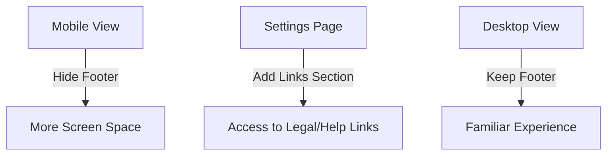

# Epic-6 - Story-1

# Remove Mobile Footer and Add Footer Links to Settings

**As a** mobile app user
**I want** a cleaner interface without redundant footer on mobile and easier access to legal/help links in settings
**so that** I have more screen space for content and can still easily find important links

## Status

Implemented

## Context

- **Background:** Currently, the application shows a footer on all views, which takes up valuable screen space on mobile devices. The footer contains copyright info, version number, and important links (Privacy Policy, Terms of Service, Help).
- **Goal:** Remove the footer from mobile view to provide more content space while preserving access to important links by moving them to the Settings page.
- **Justification:** Mobile screens have limited real estate, and the bottom navigation already provides primary navigation. Moving footer links to settings improves the mobile experience while maintaining accessibility to important information.
- **Plan:** Modify the Footer component to only display on desktop, and add a new "Links & Info" section to the Settings page that contains all the footer links plus app version and copyright information.

## Estimation

Story Points: 2 (Modifications to Footer and Settings components)

## Tasks

1. - [x] Modify `Footer.tsx` Component
   1. - [x] Update component to completely hide on mobile instead of just adjusting margins
   2. - [x] Maintain all existing functionality on desktop view

2. - [x] Enhance `SettingsPage.tsx` Component
   1. - [x] Create a new Card section titled "Links & Info"
   2. - [x] Add links to Privacy Policy, Terms of Service, and Help pages
   3. - [x] Include app version and copyright information
   4. - [x] Ensure consistent styling with other Settings cards
   5. - [x] Add appropriate icons for each link

3. - [x] Update Mobile Navigation (if needed)
   1. - [x] Ensure Settings is easily accessible from mobile navigation

4. - [x] Add Translations
   1. - [x] Add keys for the new section in Settings
   2. - [x] Reuse existing translation keys from Footer where applicable

5. - [ ] Test Changes
   1. - [ ] Verify footer is hidden on mobile devices
   2. - [ ] Confirm all links in Settings work correctly
   3. - [ ] Test responsive behavior across different screen sizes

## Constraints

- Must adhere to the existing tech stack (React, TypeScript, MUI v7)
- Maintain accessibility of all legal information and help resources
- Follow established project coding standards

## Implementation Details

```typescript
// In Footer.tsx
// Replace current isMobile margin adjustment with complete conditional rendering
return (
  <>
    {!isMobile && (
      <Box component="footer" sx={{ /* existing styles */ }}>
        {/* existing footer content */}
      </Box>
    )}
  </>
);

// In SettingsPage.tsx
// Add new links section
<Card sx={{ flex: 1, mt: 3 }}>
  <CardHeader title={t('settings:links.title', 'Links & Info')} />
  <CardContent>
    <List disablePadding>
      <ListItem component={RouterLink} to="/privacy-policy" button>
        <ListItemIcon>
          <PrivacyTipIcon />
        </ListItemIcon>
        <ListItemText 
          primary={t('footer.privacyPolicy')}
          secondary={t('settings:links.privacyDescription')}
        />
      </ListItem>
      
      <Divider variant="inset" component="li" />
      
      <ListItem component={RouterLink} to="/terms-of-service" button>
        <ListItemIcon>
          <GavelIcon />
        </ListItemIcon>
        <ListItemText 
          primary={t('footer.termsOfService')}
          secondary={t('settings:links.termsDescription')}
        />
      </ListItem>
      
      <Divider variant="inset" component="li" />
      
      <ListItem component={RouterLink} to="/help" button>
        <ListItemIcon>
          <HelpIcon />
        </ListItemIcon>
        <ListItemText 
          primary={t('footer.help')}
          secondary={t('settings:links.helpDescription')}
        />
      </ListItem>
      
      <Divider variant="inset" component="li" />
      
      <ListItem>
        <ListItemIcon>
          <InfoIcon />
        </ListItemIcon>
        <ListItemText 
          primary={t('settings:links.appInfo')}
          secondary={`© ${currentYear} ${t('footer.copyright')} | ${t('footer.version')}: ${appVersion}`}
        />
      </ListItem>
    </List>
  </CardContent>
</Card>
```

## Structure

- Modifications primarily in:
  - `src/components/layout/Footer.tsx`
  - `src/components/pages/SettingsPage.tsx`
- New translation keys added to `src/locales/`

## Diagrams



## Dev Notes

- Consider implementing a small gap at the bottom of mobile screens to prevent content from being obscured by the bottom navigation
- Make the link cards in Settings visually distinctive to draw attention
- Maintain consistent formatting and style with the rest of the Settings page
- Reuse translation keys from the footer component where possible 