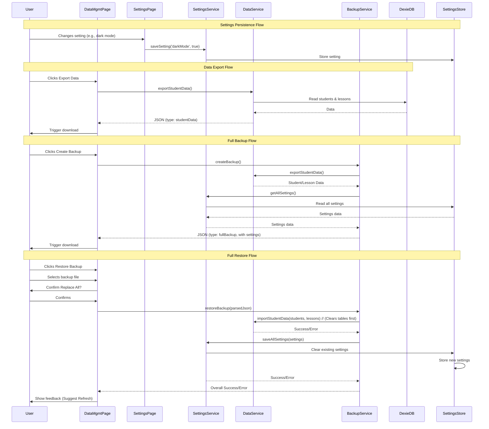

# Epic-7 - Story-1

# Implement Data Management Actions

**As a** Driving Instructor
**I want** to be able to export/import student data and separately backup/restore my entire application state (data + settings)
**so that** I can manage my data safely, transfer core data, and have complete recovery options.

## Status

Draft

## Context

- **Background:** The Data Management page (`/export-import`) currently exists with placeholder buttons. Settings are not currently persisted.
- **Goal:** Implement distinct functionalities:
    1.  **Export/Import (Vie/Tuo tiedot):** For transferring *only* student and lesson data between instances/devices.
    2.  **Backup/Restore (Luo/Palauta varmuuskopio):** For creating/restoring a *complete snapshot* including students, lessons, AND application settings (theme, language, etc.).
    3.  **Delete All Data:** For resetting the application.
- **Justification:** Provides granular control for data transfer (export/import) and comprehensive safety/recovery (backup/restore).
- **Plan:** 
    1. Persist application settings (e.g., using `localStorage`).
    2. Modify `DataManagementPage.tsx` to handle the different actions.
    3. Create service functions to interact with Dexie.js (for data) and settings storage.

## Estimation

Story Points: 8 (Increased complexity due to settings persistence, separate flows for data vs. full backup, more robust validation)

## Tasks

1.  - [ ] **Persist Application Settings**
    1.  - [ ] **Use Dexie:** Create a new `settings` table in `db.ts` to store settings (e.g., key-value pairs).
    2.  - [ ] Modify `SettingsPage.tsx` (and potentially theme/language providers/hooks) to save setting changes to the chosen storage.
    3.  - [ ] Ensure settings are loaded from storage when the application starts.
2.  - [ ] **Implement Export Data (Students & Lessons Only)**
    1.  - [ ] Create a service function (e.g., `dataService.exportStudentData()`) for students/lessons.
    2.  - [ ] Format into JSON (e.g., `{ type: "studentData", version: 1, students: [...], lessons: [...] }`).
    3.  - [ ] Implement button handler in `DataManagementPage.tsx` to call service and trigger download.
    4.  - [ ] Add UI feedback.
3.  - [ ] **Implement Import Data (Students & Lessons Only)**
    1.  - [ ] Add file input triggered by "Tuo tiedot".
    2.  - [ ] Implement file reading/parsing.
    3.  - [ ] Add confirmation dialog (Replace student/lesson data?).
    4.  - [ ] Create service function (e.g., `dataService.importStudentData(jsonData)`) to:
        1.  - [ ] Validate JSON `type` and `version`.
        2.  - [ ] Clear existing `students` and `lessons` tables.
        3.  - [ ] Bulk-insert validated data.
    5.  - [ ] Handle errors and provide UI feedback.
4.  - [ ] **Implement Create Backup (Data + Settings)**
    1.  - [ ] Create a service function (e.g., `backupService.createBackup()`) to:
        1.  - [ ] Fetch all student/lesson data from Dexie.
        2.  - [ ] Fetch all settings from their storage location.
    2.  - [ ] Format into JSON (e.g., `{ type: "fullBackup", version: 1, settings: {...}, students: [...], lessons: [...] }`).
    3.  - [ ] Implement button handler for "Luo varmuuskopio" to call service and trigger download.
    4.  - [ ] Add UI feedback.
5.  - [ ] **Implement Restore Backup (Data + Settings)**
    1.  - [ ] Add file input triggered by "Palauta varmuuskopio".
    2.  - [ ] Implement file reading/parsing.
    3.  - [ ] Add confirmation dialog (Replace ALL data and settings?).
    4.  - [ ] Create service function (e.g., `backupService.restoreBackup(jsonData)`) to:
        1.  - [ ] Validate JSON `type` and `version`.
        2.  - [ ] Clear existing `students` and `lessons` tables.
        3.  - [ ] Clear existing settings storage.
        4.  - [ ] Bulk-insert validated student/lesson data.
        5.  - [ ] Save validated settings to storage.
    5.  - [ ] Handle errors and provide UI feedback. *Force reload/refresh might be needed.* 
6.  - [ ] **Implement Delete All Data**
    1.  - [ ] Add confirmation dialog (irreversible, delete ALL data?).
    2.  - [ ] Create service function (e.g., `dataService.deleteAllData()`) to clear `students` and `lessons` tables. *(Should this also clear settings? TBD)*
    3.  - [ ] Implement button handler for "Tyhjennä kaikki tiedot".
    4.  - [ ] Add UI feedback.
7.  - [ ] **Refine UI and Error Handling**
    1.  - [ ] Ensure buttons are disabled during operations.
    2.  - [ ] Provide loading indicators.
    3.  - [ ] Display informative error messages.
    4.  - [ ] Update translations for new buttons, dialogs, and messages.

## Constraints

- Use Dexie.js via service layer for student/lesson data.
- Use chosen mechanism for settings persistence.
- Robust user confirmation for destructive actions.
- Browser PWA compatibility for file handling.

## Data Models / Schema

- Define distinct JSON structures for export vs. backup:
  ```json
  // For Export/Import (Data Only)
  {
    "type": "studentData",
    "version": 1,
    "exportedAt": "YYYY-MM-DDTHH:mm:ssZ",
    "students": [ { ... } ],
    "lessons": [ { ... } ]
  }
  
  // For Backup/Restore (Full Snapshot)
  {
    "type": "fullBackup",
    "version": 1,
    "exportedAt": "YYYY-MM-DDTHH:mm:ssZ",
    "settings": { "language": "fi", "darkMode": false, ... },
    "students": [ { ... } ],
    "lessons": [ { ... } ]
  }
  ```

## Structure

- Modifications in:
  - `src/components/pages/DataManagementPage.tsx`
  - `src/components/pages/SettingsPage.tsx` (and related hooks/providers)
- New functions likely needed in:
  - `src/services/db.ts` (or `dataService.ts`, `backupService.ts`)
  - New service/utils for settings persistence (e.g., `src/services/settingsService.ts`)
- Translation updates in:
  - `src/locales/fi/settings.json`

## Diagrams



## Dev Notes

- Prioritize implementing settings persistence first.
- Decide if "Delete All Data" should also wipe settings.
- Use distinct filenames for data export vs. full backup (e.g., `ajokamu_data_...` vs `ajokamu_backup_...`).
- Restoring settings might require an application reload to take effect properly. 