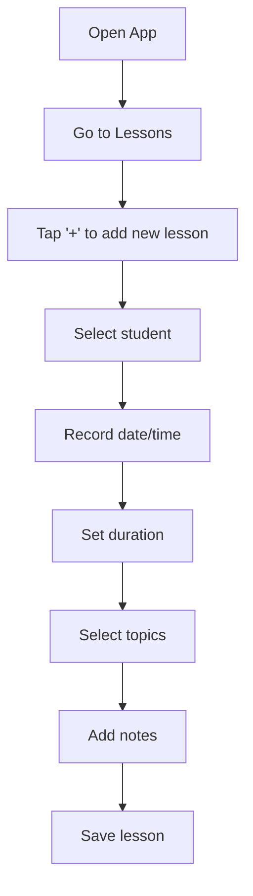
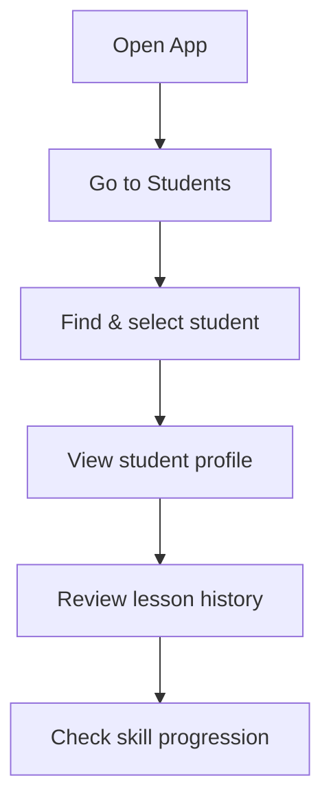
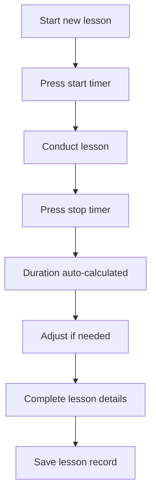

# AjoKamu - User Workflow Guide

This document outlines the designed workflow for the AjoKamu driving lesson tracker application, based on research into best practices for driving instruction tracking. The workflow is optimized for the daily activities of driving instructors and prioritizes the most frequent actions.

## Core Workflow Philosophy

AjoKamu uses a **lesson-centric workflow** rather than a student-centric approach. This means:

1. **Lessons are the primary focus** - The application is designed around recording and tracking lessons, which is the most frequent activity for instructors
2. **Students are a supporting element** - Student records are maintained as references within the lesson workflow
3. **Data visualization presents multiple perspectives** - Both lesson history and student progress views provide different lenses into the same underlying data

This approach aligns with how driving instructors typically work in their day-to-day activities.

## Daily Workflow

### Morning Preparation
1. Open AjoKamu app to the **Lessons** page (default landing page)
2. Review today's scheduled lessons 
3. Check notes from previous lessons if needed for context

### During/After Each Lesson
1. Create a new lesson entry
2. Select the corresponding student 
3. Record:
   - Date and duration
   - Topics covered
   - Skills practiced
   - Notes on progress
4. Save the lesson record

### End of Day Review
1. Review all completed lessons
2. Add any additional notes while the day is fresh
3. Check student progress across multiple lessons
4. Identify areas needing focus for future lessons

## Navigation Structure

The application's navigation is designed to support this lesson-centric workflow:

1. **Lessons** (primary entry point)
   - Today's lessons
   - Lesson history
   - Add new lesson
   
2. **Students**
   - Student directory
   - Individual student profiles
   - Student progress tracking
   
3. **Milestones**
   - Progress tracking
   - Skill achievement markers
   
4. **Settings**
   - Application preferences
   - Language settings
   
5. **Export/Import**
   - Data backup and restoration

## Key Workflows

### Recording a New Lesson

### Finding Student History

### Using the Timer Feature

## Best Practices

1. **Record lessons promptly** - Create lesson records during or immediately after each lesson while details are fresh
2. **Use topic tagging consistently** - Apply consistent topics and skill tags to make progress tracking more effective
3. **Add specific notes** - Include detailed observations about skill development for future reference
4. **Track all driving time** - Record even short lessons to maintain accurate progress metrics
5. **Regularly review student progress** - Use the student view to analyze comprehensive progress patterns

## Mobile Workflow Considerations

On mobile devices, the workflow is optimized through:

1. **Bottom navigation** - Provides easy access to main sections
2. **Quick-add buttons** - Prominently displayed "+" button for adding new lessons
3. **Responsive forms** - Input forms designed for touch interaction
4. **Swipe gestures** - Where appropriate for navigating between related views

## Offline-First Design

The workflow is designed to function identically whether online or offline:

1. All data is stored locally on the device
2. No network connection is required for any part of the workflow
3. Data can be exported/imported for backup or transfer between devices

## Data Flow Principles

Data in AjoKamu flows according to these principles:

1. **Lesson data is primary** - All lesson records include references to students
2. **Student records are referenced** - Lessons point to student records for relationship tracking
3. **Aggregation occurs on-demand** - Statistics and visualizations are calculated from raw lesson data

---

This workflow documentation will be updated as the application evolves and as we receive user feedback on the real-world usage patterns. 